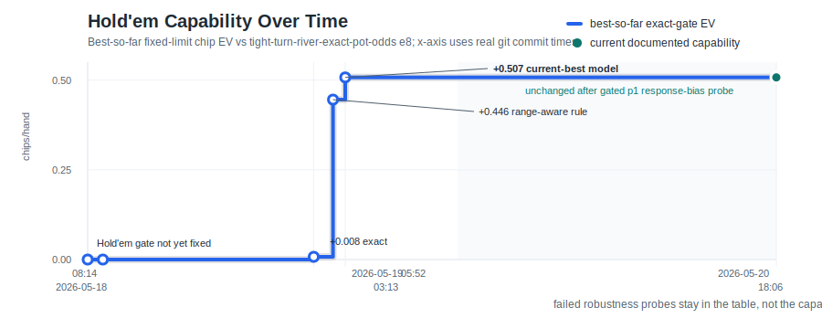

# AlphaPoker

AlphaPoker is an AlphaGo-inspired poker research repo. The first milestone is
deliberately small and verifiable: solve Kuhn poker with self-play CFR, measure
exploitability, and optionally distill the tabular policy into a neural
policy/value model. Kuhn is not full poker, but it exercises the core issue that
Go does not have: hidden information.

This follows the useful shape of `ericjang/autogo`: rules, search/self-play,
model code, experiment scripts, and tests live in the repo so agents can iterate
on experiments without changing the foundations each time.

## Quickstart

```bash
uv run --extra dev pytest
uv run python -m alphapoker.train --iterations 50000 --out experiments/kuhn_cfr_baseline
```

The training command writes:

- `strategy.json`: average CFR strategy and exploitability report.
- `metrics.json`: compact scalar metrics for experiment tracking.

To also train the small policy/value network from the CFR strategy:

```bash
uv run --extra train python -m alphapoker.train \
  --iterations 50000 \
  --network-epochs 500 \
  --out experiments/kuhn_cfr_baseline
```

Leduc policy distillation uses the same pattern:

```bash
uv run --extra train python -m alphapoker.train_leduc \
  --iterations 5000 \
  --best-response \
  --network-epochs 500 \
  --out experiments/leduc_cfr_5k
```

To distill an already-trained strategy without rerunning CFR:

```bash
uv run --extra train python -m alphapoker.distill_leduc \
  --strategy-json experiments/leduc_cfr_linear_20k/strategy.json \
  --epochs 2000 \
  --out experiments/leduc_cfr_linear_20k_distill_2k_best
```

Evaluate the distilled model policy exactly:

```bash
uv run --extra train python -m alphapoker.evaluate_leduc_model \
  --checkpoint experiments/leduc_cfr_linear_20k_distill_2k_best/leduc_policy_value.pt \
  --strategy-json experiments/leduc_cfr_linear_20k/strategy.json \
  --out experiments/leduc_cfr_linear_20k_distill_2k_best_eval
```

Train and evaluate the current fixed-limit Hold'em policy baseline:

```bash
uv run --extra train --extra holdem python -m alphapoker.train_holdem_policy \
  --hands 500 \
  --equity-sims 8 \
  --expert-player 0 \
  --opponent-policy random \
  --epochs 200 \
  --seed 41 \
  --out experiments/holdem_equity_p0_vs_random_distill_500

uv run --extra train --extra holdem python -m alphapoker.evaluate_holdem_model \
  --checkpoint experiments/holdem_equity_p0_vs_random_distill_500/holdem_policy.pt \
  --hands 1000 \
  --seed 22 \
  --opponent-policy random \
  --progress \
  --out experiments/holdem_policy_p0_vs_random_1k/metrics.json
```

Collect DAgger-style labels from states visited by an existing policy:

```bash
uv run --extra train --extra holdem python -m alphapoker.train_holdem_policy \
  --hands 500 \
  --equity-sims 8 \
  --expert-player 0 \
  --opponent-policy equity \
  --behavior-checkpoint experiments/holdem_equity_p0_vs_random_distill_1k/holdem_policy.pt \
  --epochs 200 \
  --seed 44 \
  --out experiments/holdem_dagger_p0_vs_equity_500
```

## Current Milestone

- Exact Kuhn poker environment with legal actions and zero-sum payoffs.
- Tabular CFR/CFR+ self-play trainer.
- Exact best-response exploitability by enumerating deterministic policies.
- Optional PyTorch policy/value model for distillation from the CFR average
  strategy.
- Limit Leduc poker rules for the next imperfect-information benchmark.
- Tabular Leduc CFR trainer with exact expected-value and best-response
  exploitability evaluation.
- Optional Leduc policy/value distillation model.
- Heads-up fixed-limit Texas Hold'em state transitions and hand evaluation
  built on `treys`.
- Random fixed-limit Hold'em self-play baseline for exercising the larger-game
  state machine.
- Monte Carlo equity policy baseline for fixed-limit Hold'em.
- Pot-odds-aware equity policy baseline for fixed-limit Hold'em.
- Cross-seat pot-odds parameter sweeps for stronger rule-policy gates.
- Tuned pot-odds rule-policy gate confirmed against the default pot-odds policy.
- Imperfect-information pot-odds rollout policy for one-step action-value search.
- Opponent-range-conditioned pot-odds policy that filters hidden-card samples by
  observed opponent actions under an assumed baseline policy.
- Range-aware rollout, safe-rollout, range-default safe-rollout, and fast
  range-default safe-rollout Hold'em policies for future response labeling and
  robustness gates.
- JSON metric output for Hold'em policy-vs-policy self-play baselines.
- Supervised fixed-limit Hold'em policy distillation from the equity baseline.
- Supervised fixed-limit Hold'em policy distillation from pot-odds experts.
- Supervised fixed-limit Hold'em policy distillation from rollout-search experts.
- Optional soft action-probability targets from rollout action values for
  Hold'em policy distillation.
- Optional dense rollout action-value targets with auxiliary advantage-matching
  loss for Hold'em policy distillation.
- Optional action-value example weighting, including per-player weighting, for
  Hold'em policy distillation from cached rollout-value labels.
- Cacheable Hold'em policy-imitation training examples for larger expert runs.
- Resumable Hold'em policy-imitation shard caching for long example-generation
  runs.
- Held-out Hold'em policy-imitation evaluation for cloned experts.
- Optional balanced, sqrt-balanced, and custom-exponent action-class weighting
  for Hold'em policy distillation.
- Optional per-action loss-weight overrides for Hold'em policy distillation,
  useful when frequency balancing still confuses specific actions.
- Optional player-action example weighting plus per-player target/prediction
  diagnostics for Hold'em policy distillation.
- Optional facing-bet example weighting for Hold'em policy distillation, used
  to emphasize call/fold response states without changing cached example files.
- Optional facing-bet target-action weighting, including per-player overrides,
  for Hold'em policy distillation from cached response-state labels.
- Optional filtered Hold'em policy-example recording for facing-bet response
  states after observed opponent aggression, plus appendable extra cached
  examples for focused replay mixes.
- Training-time facing-bet response target/prediction diagnostics for Hold'em
  policy distillation, reported globally and by player seat.
- Optional Hold'em action-history policy features and first-layer input
  expansion for initializing wider feature checkpoints from older policies.
- Hold'em policy-distillation checkpoint initialization, optional KL anchoring,
  rollout-margin control, and shard progress for long example-generation runs.
- Optional uniform or state-only KL anchoring for initialized Hold'em
  distillation, allowing target-action example weights without also
  upweighting the anchor term.
- REINFORCE-style Hold'em policy-gradient training against fixed opponents,
  with supervised checkpoint initialization, weighted opponent mixtures, and
  weighted seat-balanced training.
- Actor-critic Hold'em policy training with a learned value baseline and
  weighted seat-balanced training.
- Hold'em RL checkpoint selection by single-opponent or multi-opponent
  evaluation gates, with weighted-mean or minimum-score aggregation and
  per-opponent equity/rollout settings.
- Sampled abstract Hold'em MCCFR with coarse, medium, and equity abstractions,
  fallback-gated evaluation, count/reach support modes for
  min-strategy-weight sweeps, and corrected external-sampling average-policy
  updates.
- Hold'em policy-imitation example generation can use sampled abstract MCCFR
  checkpoints as hard-label experts, including fallback policy and support
  threshold controls.
- Backward-compatible Hold'em hand-summary, made-hand strength, legal-action,
  and pot-odds features for neural policies.
- Optional Monte Carlo, turn/river exact, and tight range-filtered equity features
  for Hold'em policy distillation checkpoints.
- Fixed-limit Hold'em neural checkpoint evaluation against random/equity
  baselines.
- Optional evaluator-side one-step rollout search around neural Hold'em
  checkpoints.
- State-dependent Hold'em checkpoint blending that can switch toward a
  robustness checkpoint after observed opponent aggression.
- Hold'em checkpoint blending can be restricted to selected current-player
  seats and facing-bet response states.
- Seat-specific Hold'em checkpoint evaluation that can assign different
  checkpoint policies to player 0 and player 1.
- Cross-seat Hold'em neural checkpoint evaluation.
- Hold'em match-evaluation action-count and facing-bet response diagnostics by
  model/opponent role and player seat, with optional progress reporting for
  long checkpoint evaluations.
- Hold'em neural decision diagnostics by player, facing-bet state, and opponent
  aggression bucket, including action probabilities and raise logit margins.
- Optional evaluator-side facing-bet logit calibration for neural Hold'em
  policies, including global and per-player action biases plus
  aggression-count and pre-bias raise-probability gates for response
  calibration.
- Fixed-limit Hold'em equity regression model and threshold-policy evaluation.
- Both-seat training data for fixed-limit Hold'em equity regression.
- Cacheable Hold'em equity-value training examples for longer runs.
- Tunable equity thresholds for learned Hold'em value-policy evaluation.
- Seat-aware Hold'em model evaluation and threshold-sweep tooling.
- Cross-seat threshold sweeps for Hold'em equity-value policies.
- Range-aware Hold'em pot-odds threshold sweeps with separate candidate and
  opponent equity/rollout settings.

Current exact-evaluation bests:

```bash
uv run python -m alphapoker.experiment_summary
```

## Progress Timeline

Hold'em progress is tracked as fixed-limit chip EV rather than Elo. Elo needs a
binary match-win model; these experiments directly measure `avg_utility_model`
in chips/hand with paired seats and standard errors. The timestamp column below
uses real ISO-8601 git commit times from `git log --date=iso-strict` for the
commit that first recorded the metric.



The line graph is the compact, AlphaGo-style view of the table: a best-so-far
capability curve over real commit time. The y-axis uses the comparable tight
exact gate, measured as fixed-limit chips/hand against
`tight-turn-river-exact-pot-odds` e8. The initial zero segment marks the period
before that Hold'em gate existed; failed robustness probes stay in the table
rather than lowering the line because they did not replace the current best.

| Recorded at | Commit | Milestone | Main measured gate |
| --- | --- | --- | --- |
| 2026-05-18T08:14:14-07:00 | `83a65be` | Bootstrapped exact Kuhn CFR harness. | Exploitability/testing harness only; no Hold'em gate yet. |
| 2026-05-18T08:59:30-07:00 | `07811cd` | Improved Leduc CFR distillation checkpoint selection. | Exact small-game benchmark infrastructure before Hold'em. |
| 2026-05-18T09:30:45-07:00 | `7211b2b` | Added first fixed-limit Hold'em equity policy baseline. | First larger-game rule-policy gate. |
| 2026-05-18T12:29:44-07:00 | `995c22f` | Added Hold'em policy-gradient trainer. | RL infrastructure; later direct RL checkpoints did not beat supervised gates. |
| 2026-05-19T03:13:49-07:00 | `e228875` | Tuned exact turn/river pot-odds rule policy. | `+0.0077 +/- 0.0157` vs `tight-turn-river-exact-pot-odds` e8, 4000 paired deals. |
| 2026-05-19T04:51:12-07:00 | `c760f0a` | Added range-aware pot-odds policy. | `+0.4455 +/- 0.0633` vs tight exact e8, 2000 paired deals. |
| 2026-05-19T05:02:45-07:00 | `806fda7` | Distilled the range-aware teacher into a neural policy. | `+0.3545 +/- 0.0787` vs tight exact e8, 2000 paired deals. |
| 2026-05-19T05:52:39-07:00 | `3344aef` | Added tight-range equity features and the current best 1k balanced distillation. | `+0.5073 +/- 0.0833` vs tight exact e8, 2000 paired deals. |
| 2026-05-19T07:56:19-07:00 | `fe97bbc` | Rechecked the current best with action diagnostics on a fresh larger seed. | `+0.4578 +/- 0.0579` vs tight exact e8, 4000 paired deals. |
| 2026-05-19T08:47:22-07:00 | `b325e0b` | Confirmed the current best against the range-aware opponent. | `+0.2860 +/- 0.0843` vs `tight-range-pot-odds` e4, 1000 paired deals. |
| 2026-05-19T10:31:16-07:00 | `2861fdb` | Found a KL-anchored safe-rollout side checkpoint. | `+0.4415 +/- 0.0986` vs tight exact e8 and `+0.2400 +/- 0.3793` vs safe rollout s4, but only `+0.0470 +/- 0.0813` vs tight range e4. |
| 2026-05-19T12:09:32-07:00 | `2d027bd` | Best-batch rollout actor-critic side pilot. | Good side probes, but exact gate was only `+0.0650 +/- 0.2337` over 200 paired deals. |
| 2026-05-19T12:39:31-07:00 | `38718c9` | 25% robustness-checkpoint logit blend. | Stayed positive on small exact/range probes, but failed safe rollout s1 at `-0.7375 +/- 0.5386`; not a candidate. |
| 2026-05-19T13:16:01-07:00 | `cc55a67` | Quantified the cheap safe-rollout baseline. | Current best stayed negative vs `tight-safe-rollout-pot-odds` s1 at `-0.9750 +/- 0.6183` over 40 paired deals. |
| 2026-05-19T13:23:23-07:00 | `fa8948c` | Tried exact-selected rollout actor-critic. | Exact-only selection chose the initial checkpoint; follow-up range gate was flat at `-0.0100 +/- 0.3449` over 100 paired deals. |
| 2026-05-19T13:35:55-07:00 | `1d32683` | Tried multi-gate actor-critic selection. | Minimum selection over exact/range also chose the initial checkpoint; best minimum score was `-0.1750`, limited by exact. |
| 2026-05-19T13:45:42-07:00 | `5d88477` | Added per-gate actor-critic selection including safe rollout. | The 20-hand checkpoint was selected, but best minimum score was still `-2.2500`, again limited by exact. |
| 2026-05-19T14:05:21-07:00 | `bdec05e` | Tried unweighted KL2 safe-rollout DAgger. | Exact was noisy-positive at `+0.2950 +/- 0.4455`, but range failed at `-0.3750 +/- 0.2848` over 100 paired deals. |
| 2026-05-19T14:12:16-07:00 | `7f3d952` | Tried a 50% robustness-checkpoint logit blend. | Range stayed positive at `+0.2750 +/- 0.2105`, but safe rollout s1 stayed negative at `-0.4000 +/- 0.6534`. |
| 2026-05-19T14:47:54-07:00 | `26e80b3` | Tried a range-refresh pass from the safe-rollout side checkpoint. | Exact spiked on a small probe at `+0.7950 +/- 0.3197`, but range was only `+0.0950 +/- 0.3300` and safe rollout s1 failed at `-1.1625 +/- 0.6153`. |
| 2026-05-19T15:03:29-07:00 | `7023b00` | Tried aggression-triggered adaptive checkpoint blends. | Full response weight was strong on small exact/range probes (`+0.6800 +/- 0.2878`, `+0.5800 +/- 0.2753`) but failed safe rollout s1 at `-1.6875 +/- 0.6958`. |
| 2026-05-19T15:10:36-07:00 | `7eedeea` | Directly checked the KL1 robustness checkpoint against safe rollout s1. | The checkpoint that was positive vs safe s4 still failed the cheaper s1 probe at `-0.9375 +/- 0.5413` over 40 paired deals. |
| 2026-05-19T15:33:35-07:00 | `daab72d` | Tried an s1-specific safe-rollout DAgger pass. | Small exact spiked to `+0.9800 +/- 0.5184`, but range was only `+0.1750 +/- 0.4076` and safe rollout s1 stayed negative at `-0.6500 +/- 1.1755`. |
| 2026-05-19T15:57:39-07:00 | `fe4274e` | Tried sqrt-balanced s1 safe-rollout DAgger. | Rare raises were preserved in training, but range failed at `-0.0200 +/- 0.4721` and safe rollout s1 was `-0.8375 +/- 1.2561`; exact was `+0.5800 +/- 0.7071`. |
| 2026-05-19T16:41:33-07:00 | `abf88ee` | Labeled current-best self-play with the safe-rollout expert. | Safe rollout s1 improved to `+0.3650 +/- 0.8909` over 100 paired deals and range stayed positive at `+0.1460 +/- 0.3804`, but exact was flat at `+0.0460 +/- 0.4930`; side checkpoint only. |
| 2026-05-19T16:59:21-07:00 | `7dcbf30` | Tried static blends toward the safe-expert side checkpoint. | A 25% blend looked strong on small exact/range probes (`+1.0200 +/- 0.8197`, `+0.4200 +/- 0.5221`) but failed safe rollout s1 at `-2.5875 +/- 1.4214`; not a candidate. |
| 2026-05-19T17:21:09-07:00 | `6dd614a` | Tried an aggression-triggered switch to the safe-expert side checkpoint. | Exact/range stayed positive on larger probes (`+0.1780 +/- 0.4707`, `+0.2240 +/- 0.3381`), but safe rollout s1 failed at `-1.5550 +/- 0.8788`; not a candidate. |
| 2026-05-19T17:43:38-07:00 | `c890a0c` | Scaled safe-expert self-play DAgger to 300 hands with a stronger KL anchor. | Tight exact stayed positive on a small probe (`+0.4400 +/- 0.7888`), but range flattened to `+0.0150 +/- 0.4784` and safe rollout s1 stayed negative at `-0.3625 +/- 1.4758`. |
| 2026-05-19T18:41:56-07:00 | `2a8bc90` | Mixed original range-teacher replay with safe-expert self-play labels. | A 200-hand base replay plus 100 safe-expert hands spiked tight exact to `+0.7000 +/- 0.5822`, but range failed at `-0.1100 +/- 0.4534` and safe rollout s1 failed at `-1.0875 +/- 1.3269`. |
| 2026-05-19T19:04:07-07:00 | `81d7135` | Swept KL/class-weight replay variants from the mixed safe-expert replay set. | KL8 sqrt-balanced recovered small exact/range probes (`+0.9400 +/- 0.7225`, `+0.7050 +/- 0.3965`), but safe rollout s1 failed at `-1.5875 +/- 1.1674`; KL16 balanced was also exact/range positive but safe negative. |
| 2026-05-19T19:28:35-07:00 | `a079098` | Upweighted facing-bet response states in the mixed replay set. | KL8 sqrt-facing3 preserved small exact/range probes (`+0.8750 +/- 0.5249`, `+0.5300 +/- 0.4541`) but still failed safe rollout s1 at `-1.0500 +/- 1.0175`; not a candidate. |
| 2026-05-19T19:46:54-07:00 | `7db8e2b` | Tried explicit action-history features for safe-expert self-play labels. | First-layer-expanded KL8 sqrt-facing3 action-history pilot still failed safe rollout s1 at `-1.2750 +/- 1.0562` over 40 paired deals. |
| 2026-05-19T20:23:11-07:00 | `5574b59` | Mixed action-history range replay with safe-expert labels. | A 774-example base replay plus 472 safe labels still failed safe rollout s1 at `-1.5750 +/- 1.1819`; no exact/range extension. |
| 2026-05-19T20:39:47-07:00 | `c6c7dee` | Targeted action-history safe labels at player 1. | P1-focused replay kept small exact/range probes positive (`+0.6000 +/- 0.7372`, `+0.7800 +/- 0.7019`) and improved the cheap safe point to `-0.6250 +/- 1.1647`, but safe remained negative and P1 was still weak. |
| 2026-05-19T20:58:41-07:00 | `70e91b1` | Increased player-1 safe replay to 300 hands. | The larger P1 dose kept small exact/range probes positive (`+0.9700 +/- 0.7543`, `+0.2600 +/- 0.3663`) but cheap safe stayed negative at `-0.7125 +/- 1.3259`; P1 improved to `-0.9250` while P0 regressed. |
| 2026-05-19T21:21:42-07:00 | `13822dd` | Rebalanced 300-hand safe replay across both seats. | The 2,305-example mix kept small exact/range probes positive (`+0.4350 +/- 0.8808`, `+0.4250 +/- 0.5490`) but cheap safe stayed negative at `-0.8125 +/- 1.0932`; both safe seats were negative. |
| 2026-05-19T21:33:48-07:00 | `584196a` | Switched balanced p0+p1 safe replay to full class balancing. | Small exact/range stayed positive (`+0.4950 +/- 0.6832`, `+0.3650 +/- 0.7355`) and safe s1 smoked positive at `+0.5375 +/- 1.2551`, but a 100-paired safe confirmation was flat-negative at `-0.0850 +/- 0.9937`; side checkpoint only. |
| 2026-05-19T21:38:59-07:00 | `013dd7b` | Lowered the KL anchor on the balanced-class safe replay. | KL4 did not improve the supervised raise/fold mix and failed cheap safe rollout at `-1.2125 +/- 1.4531`; no exact/range extension. |
| 2026-05-19T21:47:45-07:00 | `2e72c2c` | Tested action-history-compatible adaptive blends. | Expanded the current best to action-history inputs and blended toward the balanced-class side checkpoint after opponent aggression; 50% failed at `-2.5500 +/- 1.7593`, while 25% still failed at `-0.5875 +/- 1.3301`. |
| 2026-05-19T21:52:00-07:00 | `b7de1aa` | Selected full-balanced safe replay by train loss. | Removing the validation split ran to epoch 200, but still collapsed raise/fold (`raise` target 440 vs predicted 297; `fold` target 390 vs predicted 533) and failed cheap safe rollout at `-0.8250 +/- 1.1044`; no exact/range extension. |
| 2026-05-19T22:02:28-07:00 | `a7f6904` | Added explicit raise/fold loss shaping. | `raise=2.0`, `fold=0.5` moved the cheap safe probe positive (`+0.8125 +/- 1.8117`) but damaged tight exact (`-0.4150 +/- 0.7566`) and flattened range (`-0.0650 +/- 0.4600`); diagnostic only. |
| 2026-05-19T22:15:43-07:00 | `562c955` | Swept milder and call-aware action shaping. | `raise=1.5`, `fold=0.75` failed safe rollout (`-1.7375 +/- 1.4825`); p1-focused heavy shaping also failed (`-0.8375 +/- 1.1339`); adding `call=1.5` kept exact/range near flat-positive but safe was too noisy (`+0.3000 +/- 2.0511`). |
| 2026-05-19T22:29:07-07:00 | `4191fc5` | Tried player-action weighting for player-1 responses. | KL8 p1 call/raise upweighting still failed cheap safe rollout (`-1.0250 +/- 1.4232`); KL2 moved p1 raises but stayed negative (`-0.4000 +/- 1.5183`), and a more call-heavy KL2 variant failed at `-1.4500 +/- 1.7017`. |
| 2026-05-19T22:56:26-07:00 | `93e7682` | Tried soft rollout action-probability targets. | A 20-hand soft safe-rollout replay raised target mass, but player 1 still under-raised and cheap safe rollout failed at `-1.8625 +/- 0.8881` over 40 paired deals. |
| 2026-05-19T23:08:24-07:00 | `145dea5` | Targeted soft safe-rollout labels at player 1. | KL2 train selection improved p1 raise imitation and made the cheap safe probe noisy-positive (`+0.5750 +/- 1.0963`), but exact and range gates failed (`-0.4000 +/- 0.3654`, `-0.3050 +/- 0.1972`). |
| 2026-05-19T23:19:47-07:00 | `99690c8` | Made the p1 soft branch blend-compatible with the current best. | A 50% aggression-triggered blend stayed near flat on exact/range/safe (`-0.0500 +/- 0.3281`, `+0.0750 +/- 0.3311`, `+0.0375 +/- 0.6366`); no current-best update. |
| 2026-05-19T23:23:50-07:00 | `53aa6b7` | Mixed base replay with p1 soft safe-rollout labels. | The 774-example base replay plus 155 p1-soft labels matched p1 raises, but cheap safe rollout still failed at `-0.2625 +/- 0.5495`; p0 regressed while p1 improved. |
| 2026-05-19T23:31:23-07:00 | `4b1d806` | Added symmetric p0 soft safe-rollout replay. | The 774-example base replay plus p0/p1 soft labels still failed cheap safe rollout at `-0.4250 +/- 0.6793`; both-seat soft replay over-corrected p0 raises. |
| 2026-05-19T23:35:10-07:00 | `56db2ee` | Added seat-specific checkpoint evaluation. | Tooling can now evaluate different neural checkpoints for player 0 and player 1; `tests/test_evaluate_holdem_model.py` passed (`19 passed`). |
| 2026-05-19T23:38:10-07:00 | `0e012e4` | Tried a current-best plus p1-soft seat composite. | Current best for player 0 plus p1-soft for player 1 failed cheap safe rollout at `-1.7625 +/- 0.9729`; no exact/range extension. |
| 2026-05-19T23:42:25-07:00 | `27af624` | Added dense rollout action-value targets. | Cached Hold'em examples can now store per-action rollout values, and training can add an auxiliary legal-action advantage-matching loss; dataset/training tests passed (`55 passed`). |
| 2026-05-19T23:49:00-07:00 | `7ad0461` | Tried value-aware soft safe-rollout targets. | A 40-hand value-target replay preserved 200 action-value examples, but the best KL2 train-selected sweep still predicted only `5` player-1 raises vs `11` target, so live gate extension was skipped. |
| 2026-05-20T00:32:12-07:00 | `ecdae88` | Increased action-value pressure and mixed value replay. | Strong value-only training repaired the cheap safe smoke test but broke exact/range; 2x value mixed replay kept small exact/range probes positive and narrowed cheap safe to `-0.335 +/- 0.481` over 100 paired deals, still not a confirmed repair. |
| 2026-05-20T00:48:43-07:00 | `d65941a` | Checked player-1 hard-label weighting and full value-branch switching. | P1 call/fold/raise weights left the supervised p1 mix essentially unchanged; a 100% switch to the value-only branch failed exact/range/safe probes (`-1.785`, `-0.320`, `-1.0625`), so runtime branch switching is not a candidate. |
| 2026-05-20T00:51:42-07:00 | `eb03b53` | Added direct action-value example weighting. | Training can now weight cached rollout-value examples globally or by current player; `tests/test_train_holdem_policy.py` passed (`30 passed`). |
| 2026-05-20T01:12:46-07:00 | `113c325` | Tried value-weighted replay and p1-only value replay. | Direct p1 value weighting kept exact positive but flattened range and did not repair safe rollout; p1-only value replay failed cheap safe rollout badly at `-2.2625 +/- 0.8761`. |
| 2026-05-20T01:20:57-07:00 | `88bfdc3` | Added facing-bet response diagnostics to Hold'em evaluation. | Evaluators now report action counts while a player is facing a bet/raise by role and seat; evaluator/model tests passed (`38 passed`). |
| 2026-05-20T01:21:06-07:00 | `484a296` | Compared safe-rollout facing-bet behavior for current best and the value400 side checkpoint. | On the same h40 safe seed, current best was `-1.425 +/- 0.949` with model-facing call49/fold46/raise34; value400 improved to `-0.050 +/- 0.944` with call51/fold41/raise49 but player 1 remained weak (`-1.55`), so current best is unchanged. |
| 2026-05-20T01:32:11-07:00 | `5eea34f` | Tried a seat-specific value400/current-best composite. | Value400 for player 0 plus current best for player 1 was positive on h40 safe (`+0.450 +/- 0.831`) and range h100 (`+0.405 +/- 0.313`), but safe h100 stayed negative (`-0.220 +/- 0.538`) and exact h100 was only `+0.240 +/- 0.468`; current best is unchanged. |
| 2026-05-20T01:37:19-07:00 | `0f279e8` | Tried value400 logit blends from the action-history-expanded current best. | 25% after aggression, 50% after aggression, and static 25% blends all failed the h40 safe probe (`-1.125 +/- 0.962`, `-1.350 +/- 0.868`, `-1.0125 +/- 0.941`); not extended. |
| 2026-05-20T01:43:24-07:00 | `e4913ae` | Evaluated value400 class/player weighting variants. | Full-balanced value400 was less bad on h40 safe (`-0.5625 +/- 0.930`) but player 1 failed badly (`-1.775`); p1 call/fold and call/raise/fold weighting variants also failed (`-0.9125 +/- 0.999`, `-1.075 +/- 1.140`). |
| 2026-05-20T01:47:31-07:00 | `da0b8d6` | Tried a hard value400 switch after opponent aggression. | Full switch from action-history-expanded current best to value400 after the first opponent bet/raise also failed h40 safe (`-0.625 +/- 1.000`), with both seats negative. |
| 2026-05-20T01:52:49-07:00 | `401a12e` | Added facing-bet target-action training weights. | Training can now weight response-state target actions globally or by player; `tests/test_train_holdem_policy.py` passed (`32 passed`). |
| 2026-05-20T02:04:24-07:00 | `332b2a2` | Tried player-1 facing-bet call/fold weighting. | P1 `call=4.0`, `fold=0.5` improved h40 safe to `+0.325 +/- 0.949` and h100 safe to `+0.235 +/- 0.572`, but h100 range failed at `-0.230 +/- 0.317`; adding p1 `raise=2.0` flattened h40 safe to `+0.0125 +/- 0.849`. Current best unchanged. |
| 2026-05-20T02:07:36-07:00 | `e96c5fc` | Added training-time facing-bet response diagnostics. | Policy-distillation metrics now report target and predicted action counts restricted to facing-bet states, globally and by player; `tests/test_train_holdem_policy.py` passed (`33 passed`). |
| 2026-05-20T02:14:51-07:00 | `53a53e5` | Tried stronger lower-KL player-1 facing-bet call/fold weighting. | KL2 p1 `call=12.0`, `fold=0.25` moved cached p1 response counts toward target (`call 47->52`, `fold 87->84`, `raise 28->26`), but h40 safe failed at `-0.800 +/- 0.944`; both seats were negative. |
| 2026-05-20T02:17:54-07:00 | `0d9c57a` | Added uniform KL weighting for initialized distillation. | `--init-kl-example-weighting uniform` keeps the KL anchor unweighted while supervised/value losses still use example weights; `tests/test_train_holdem_policy.py` passed (`33 passed`). |
| 2026-05-20T02:20:46-07:00 | `22f7404` | Tried p1 facing-bet weights with uniform KL anchoring. | Uniform KL made the cached p1 response counts move strongly (`call=64`, `fold=70`, `raise=28` vs target `59/77/26`), but over-shifted live play and failed h40 safe at `-1.7125 +/- 0.7881`. |
| 2026-05-20T02:23:40-07:00 | `a9efba6` | Added state-only KL weighting for initialized distillation. | `--init-kl-example-weighting state` keeps state-level weights such as facing-bet weighting on the KL anchor while excluding target-action weights; `tests/test_train_holdem_policy.py` passed (`33 passed`). |
| 2026-05-20T02:24:19-07:00 | `1b25d2a` | Tried softer uniform-KL and state-KL p1 facing-bet metric probes. | Softer uniform KL still over-raised player 0 (`raise=100` vs target `77`), and state-KL was worse (`raise=107`); both were stopped at metrics without live extension. |
| 2026-05-20T02:26:22-07:00 | `b2c87a5` | Tried p1-only facing-bet weights without global facing-bet upweighting. | Removing `facing_bet_weight=3.0` still over-raised player 0 on cached responses (`raise=108` vs target `77`), so the branch was stopped at metrics. |
| 2026-05-20T02:31:07-07:00 | `7349203` | Added evaluator-side facing-bet logit calibration. | Tooling can bias model logits only while facing a bet/raise, globally or per player; `tests/test_evaluate_holdem_model.py` passed (`21 passed`). |
| 2026-05-20T02:34:48-07:00 | `7e42eca` | Tried runtime response calibration on the current best. | Global facing-bet `raise=+0.5`, `fold=-0.5` improved the h40 safe s1 smoke to `+0.050 +/- 0.715`; player 1 stayed negative and exact/range gates are not confirmed, so current best is unchanged. |
| 2026-05-20T03:06:49-07:00 | `47ba023` | Gated player-specific logit calibration by observed aggression. | Player-specific facing-bet biases can now wait until at least N opponent bets/raises; `tests/test_evaluate_holdem_model.py` passed (`22 passed`). |
| 2026-05-20T03:19:48-07:00 | `3f63500` | Probed global, player-specific, and aggression-gated runtime calibration. | Global bias kept h100 exact/range positive but failed safe s1 (`-0.285 +/- 0.493`); ungated player-1 raise/fold repaired safe (`+0.655 +/- 0.548`) but failed range (`-0.385 +/- 0.342`); after-two-aggressions player-1 raise/fold stayed positive on protective exact/range/safe h100 seeds (`+0.550`, `+0.265`, `+0.220`) but is not confirmed enough to replace the current best. |
| 2026-05-20T03:35:33-07:00 | `d5bece6` | Confirmed gated runtime calibration on a larger safe-rollout probe. | After-two-aggressions player-1 raise/fold calibration stayed positive vs cheap safe rollout over 200 paired deals (`+0.2925 +/- 0.4591`; model-player seats `+0.4300`, `+0.1550`), but the interval still crosses zero, so current best is unchanged. |
| 2026-05-20T04:08:41-07:00 | `47054fe` | Checked gated calibration on larger exact and range protective gates. | Range e4 h1000 stayed positive (`+0.253 +/- 0.113`), but exact e8 h1000 regressed to `+0.171 +/- 0.140`, far below the current best; the calibrated runtime variant is not a candidate replacement. |
| 2026-05-20T04:19:26-07:00 | `aea95b7` | Tried p1-only gated calibration without the global response bias. | Exact/range h100 stayed positive (`+0.480 +/- 0.461`, `+0.610 +/- 0.222`), but safe h100 failed (`-0.685 +/- 0.563`; model-player seats `-1.030`, `-0.340`), so this cleaner branch is not viable. |
| 2026-05-20T04:23:17-07:00 | `fa57b88` | Added aggression gating for global runtime calibration. | Global facing-bet logit biases can now wait until at least N opponent bets/raises; `tests/test_evaluate_holdem_model.py` passed (`23 passed`). |
| 2026-05-20T04:33:08-07:00 | `70661e9` | Probed global plus player-specific calibration gated after two opponent aggressions. | Small exact/range/safe h100 probes were all positive (`+0.560 +/- 0.460`, `+0.570 +/- 0.227`, `+0.175 +/- 0.599`), but safe remains weak and noisy, so current best is unchanged. |
| 2026-05-20T04:44:16-07:00 | `5b704e2` | Confirmed gated global calibration on a larger safe-rollout probe. | The h200 cheap-safe result stayed only weak-positive (`+0.1125 +/- 0.4484`; model-player seats `+0.0000`, `+0.2250`), so it is still diagnostic rather than a current-best update. |
| 2026-05-20T05:18:58-07:00 | `4bb850d` | Checked gated global calibration on larger exact and range protective gates. | Range e4 h1000 stayed positive (`+0.3115 +/- 0.0943`), but exact e8 h1000 was only `+0.2125 +/- 0.1265`, far below the current best; the runtime branch is rejected. |
| 2026-05-20T05:26:32-07:00 | `ad3612d` | Delayed global calibration until after three opponent aggressions. | Small exact/range h100 probes stayed positive (`+0.480 +/- 0.461`, `+0.610 +/- 0.222`), but safe h100 failed (`-0.530 +/- 0.585`; model-player seats `-1.250`, `+0.190`), so the delay lost the rollout repair. |
| 2026-05-20T05:34:02-07:00 | `fac3618` | Tried asymmetric per-player calibration without a global bias. | Small exact/range h100 probes again stayed positive (`+0.480 +/- 0.461`, `+0.610 +/- 0.222`), but safe h100 failed (`-0.485 +/- 0.604`; model-player seats `-0.630`, `-0.340`), so the p0 nudge was not enough. |
| 2026-05-20T05:48:15-07:00 | `fd4e3ac` | Added opponent-aggression-gated training weights. | P1-only gated value-replay weighting after two opponent aggressions worsened h100 safe rollout to `-0.920 +/- 0.602`; a stronger KL2/uniform metric probe shifted p0 and did not increase p1 raises, so this is tooling/diagnostics only. |
| 2026-05-20T05:53:44-07:00 | `be2c55e` | Tried global plus player-1 gated training weights. | The h40 safe smoke was only `+0.0625 +/- 0.9083`, with model-player 1 still negative (`-0.4750`), so this branch is too noisy and not a current-best candidate. |
| 2026-05-20T06:19:43-07:00 | `bf1eddb` | Added focused conditional response replay tooling. | Training can now record only facing-bet states after N opponent aggressions and append extra cached examples; focused dataset/training/evaluator tests passed (`91 passed`). |
| 2026-05-20T06:19:49-07:00 | `ab3fd60` | Tried focused player-1 after-two-aggression response replay. | 36 focused p1 response labels moved cached p1 raises, and x4/x2 replay mixes repaired h40 safe smoke (`+0.825 +/- 0.612`, `+0.575 +/- 0.661`), but both failed exact h100 (`-0.595 +/- 0.492`, `-0.615 +/- 0.472`); current best is unchanged. |
| 2026-05-20T06:31:59-07:00 | `f31e5b6` | Swept focused replay dose and runtime blends. | Runtime blends after two opponent aggressions were h40-safe positive overall (`+0.325`, `+0.475`, `+0.600`) but left p1 negative; x1 failed safe (`-0.625 +/- 0.673`) and x1.5 was near-flat with p1 still weak (`-0.0875 +/- 0.814`, p1 `-1.700`), so no exact/range extension. |
| 2026-05-20T06:36:04-07:00 | `5d74a42` | Added same-seed expanded-current-best safe baseline. | The action-history-expanded current best failed the blend seed's h40 cheap-safe control at `-1.375 +/- 0.782` with both seats negative (`p0 -1.175`, `p1 -1.575`), confirming the robustness gap persists without the focused branch. |
| 2026-05-20T06:49:03-07:00 | `dcc1246` | Tried broader player-1 after-one-aggression response replay. | 101 focused p1 response labels and an x1 mix repaired h40 safe to `+0.2375 +/- 0.692` with both seats non-negative and kept h100 range strong at `+0.920 +/- 0.345`, but exact h100 was only `+0.065 +/- 0.329` with player 0 negative, so this is a side checkpoint only. |
| 2026-05-20T07:09:47-07:00 | `a8a72ed` | Probed after-one seat composites and player-0 response bias. | Static seat composites failed h40 safe (`-0.7125 +/- 0.626`, `-0.3250 +/- 0.769`); adding a player-0 response bias kept h100 exact/range positive (`+0.410 +/- 0.315`, `+0.515 +/- 0.286`) but h100 safe failed at `-0.480 +/- 0.506` because player 1 fell to `-2.560`. |
| 2026-05-20T07:34:01-07:00 | `6c920e8` | Scaled after-one player-1 response replay to 300 hands. | 336 focused labels kept p1 response imitation close to target and made h40 safe strongly positive (`+1.3125 +/- 1.007`), while h100 exact/range stayed positive (`+0.380 +/- 0.263`, `+0.595 +/- 0.338`); h100 safe still failed at `-0.600 +/- 0.482` because player 1 fell to `-2.170`. |
| 2026-05-20T08:05:58-07:00 | `6a1a5cf` | Tried balanced-safe after-one player-1 response replay. | 329 balanced-safe focused labels kept p1 cached response imitation close (`153/181/157` predicted vs `167/163/161` target) and made h40 safe weak-positive (`+0.275 +/- 0.711`), but exact h100 failed (`-0.755 +/- 0.412`), range was flat (`+0.005 +/- 0.323`), and h100 safe failed (`-0.310 +/- 0.556`). |
| 2026-05-20T08:19:35-07:00 | `49b1c5d` | Probed runtime player-1 response bias on the h300 after-one checkpoint. | A moderate p1 `raise=+0.5`, `fold=-0.5` bias after one opponent aggression made h40 safe weak-positive (`+0.3375 +/- 0.895`) by flipping p1 positive, while a stronger raise bias flattened it (`+0.025 +/- 0.948`); h100 safe was only `+0.090 +/- 0.565` and still lost as player 1 (`-1.490`). |
| 2026-05-20T08:33:35-07:00 | `72da424` | Added player/state gates for checkpoint blending. | Evaluator blending can now apply only while facing a bet/raise and only for selected current-player seats; evaluator and Hold'em aggregation tests passed (`31 passed`). |
| 2026-05-20T08:39:54-07:00 | `6613512` | Tried p1-only conditional response blending toward the h300 checkpoint. | Restricting the blend to player 1, facing-bet states, after one opponent aggression failed h40 safe: 50% scored `-0.600 +/- 0.627` (p0 `+0.100`, p1 `-1.300`), and 100% scored `-0.850 +/- 0.848` (p0 `+0.100`, p1 `-1.800`); current best unchanged. |
| 2026-05-20T08:55:35-07:00 | `a4319fd` | Checked h300 same-seed seat composites. | On the response-blend seed, current best failed h40 safe at `-1.1375 +/- 0.741` (p0 `+0.100`, p1 `-2.375`), h300-both failed at `-0.6625 +/- 1.246`, current p0 plus h300 p1 was best but still negative at `-0.325 +/- 0.741`, and h300 p0 plus current p1 failed at `-1.475 +/- 0.978`. |
| 2026-05-20T09:06:55-07:00 | `2b149a4` | Retrained the h300 replay mix with validation selection. | A 10% validation split selected epoch 31 and under-raised p1 cached responses (`86` predicted raises vs `161` target); h40 safe was only `+0.025 +/- 0.862` and h100 safe failed at `-0.260 +/- 0.485` with player 1 still negative (`-1.130`). |
| 2026-05-20T09:12:18-07:00 | `71293fb` | Upweighted h300 player-1 action-value examples. | `--player-action-value-weight 1=3.0` kept cached p1 raises near target (`147` predicted vs `161` target), but live h40 safe failed at `-0.3875 +/- 0.805`; both seats were negative and facing-bet raises dropped to `26`. |
| 2026-05-20T09:18:15-07:00 | `113914d` | Combined current p0, h300 p1, and p1 response bias. | Current best for player 0 plus h300 for player 1 with p1 `raise=+0.5`, `fold=-0.5` after one opponent aggression still failed h40 safe at `-0.3125 +/- 0.887`; player 1 stayed negative at `-0.725` despite `18` facing-bet raises. |
| 2026-05-20T09:29:02-07:00 | `3c3e072` | Collected h300-behavior player-1 response replay. | A 100-hand h300-behavior cache added 133 focused labels (`call/fold/raise = 56/26/51`), and the 1,643-example mix kept p1 cached raises close (`195` predicted vs `212` target), but h40 safe failed at `-0.975 +/- 1.020` with player 1 at `-2.100`. |
| 2026-05-20T09:34:02-07:00 | `64600f8` | Added range-aware rollout and safe-rollout policies. | `tight-range-rollout-pot-odds` and `tight-range-safe-rollout-pot-odds` are available for self-play, evaluation, and dataset labeling; focused tests passed (`113 passed`). Initial h40/h4 probes were interrupted as too slow, so this teacher needs caching before real gates. |
| 2026-05-20T09:52:21-07:00 | `81bbece` | Added a range-default safe-rollout policy. | `tight-range-default-safe-rollout-pot-odds` keeps cheap exact rollout action values but uses a range-aware default fallback for the safe gate; focused Hold'em tests passed (`115 passed`). |
| 2026-05-20T09:57:23-07:00 | `be4d019` | Probed range-default safe-rollout practicality. | The current-best h40 probe was interrupted after roughly three minutes without output; h4 completed in 29.27s and failed at `-5.125 +/- 3.300` vs `tight-range-default-safe-rollout-pot-odds` s1, so the current best remains unchanged. |
| 2026-05-20T10:03:56-07:00 | `1ea6cf4` | Added a fast range-default safe-rollout policy. | `tight-fast-range-default-safe-rollout-pot-odds` keeps the exact rollout values but limits the range-aware safe fallback to two default equity sims and four matching attempts; focused Hold'em tests passed (`117 passed`). |
| 2026-05-20T10:08:05-07:00 | `191ee1a` | Probed the fast range-default safe-rollout gate. | h4 finished in 8.67s with the same `-5.125 +/- 3.300` result; h40 finished in 175.72s but failed at `-1.425 +/- 0.753` with model-player seats `-0.450` and `-2.400`, so the current best remains unchanged. |
| 2026-05-20T10:15:59-07:00 | `78ff000` | Collected fast range-default player-1 response labels. | A 40-hand behavior cache from the current best produced 46 after-one facing-bet labels with target `call/fold/raise = 18/8/20`, less fold-heavy than the older cheap-safe h100 cache (`34/27/40`). |
| 2026-05-20T10:18:59-07:00 | `c1a9806` | Tried replaying the fast range-default response labels. | Adding the 46-label cache to the 1,174-example base replay matched cached p1 responses reasonably (`65/95/48` predicted vs `77/85/46` target), but h40 fast-range-default failed worse at `-1.625 +/- 0.714`; no exact/range extension. |
| 2026-05-20T10:25:14-07:00 | `308e775` | Tried runtime p1 response calibration on the fast range-default gate. | Current best with p1 `raise=+0.5`, `fold=-0.5` after one opponent aggression failed h40 fast-range-default at `-1.800 +/- 0.696`; player 1 regressed to `-3.150`, so simple local calibration is rejected. |
| 2026-05-20T12:38:42-07:00 | `0280223` | Tried 2k range-feature distillation with action-history features. | Exact e8 h500 smoke was strong at `+0.733 +/- 0.174`, but range e4 h500 failed at `-0.026 +/- 0.109`; training also overpredicted raises (`966` predicted vs `302` target), so this is not a current-best replacement. |
| 2026-05-20T12:56:37-07:00 | `ea05cfe` | Swept softer class weights for the 2k action-history distillation. | Power-0.75 reduced but did not remove over-raising and scored `+0.627 +/- 0.174` exact, `+0.065 +/- 0.110` range; sqrt-balanced matched raises better but scored only `+0.569 +/- 0.152` exact, `-0.035 +/- 0.091` range. |
| 2026-05-20T13:17:00-07:00 | `d33bb32` | Added range-aware threshold sweeps for the teacher policy. | Tiny multi-gate pilot was too noisy for promotion: default thresholds led exact h10 at `+1.150 +/- 0.958`, `0.62/0.90/0.00` led range h10 at `+1.500 +/- 0.691`, and `0.70/0.95/-0.05` led safe s1 h4 at `+2.250 +/- 1.831`. |
| 2026-05-20T13:28:53-07:00 | `6c84ee6` | Rechecked the `0.62/0.90/0.00` threshold retune. | Focused h20 exact/range comparison rejected the retune: default scored `+1.175 +/- 0.576` exact and `+0.425 +/- 0.284` range, while `0.62/0.90/0.00` scored `+1.125 +/- 0.512` exact and `-0.175 +/- 0.578` range. |
| 2026-05-20T13:44:40-07:00 | `b54fb35` | Rechecked the 2k balanced range-feature distillation. | The checkpoint stayed positive but below current best on range h1000 (`+0.153 +/- 0.085`), and its safe-rollout h40 spike (`+1.7875 +/- 0.893`) failed h100 confirmation at `-0.670 +/- 0.460`; not a replacement. |
| 2026-05-20T13:49:37-07:00 | `442a76f` | Tried seat-specific composites with the 2k balanced checkpoint. | 2k for player 0 plus current best for player 1 was near-flat negative on safe h40 (`-0.200 +/- 0.744`); current best for player 0 plus 2k for player 1 failed harder (`-1.4375 +/- 0.600`). |
| 2026-05-20T14:05:23-07:00 | `30f358b` | Tried evaluator-side neural one-step rollout search. | A cheap safe-rollout smoke with one rollout sim/action and an exact-policy inner opponent failed at `-1.1875 +/- 1.8778` over 8 paired deals; player 0 was the weak seat (`-3.500 +/- 2.712`). |
| 2026-05-20T14:09:57-07:00 | `292c792` | Compared neural rollout search to the same-seed control. | The current-best control was also negative but better at `-0.4375 +/- 1.2763`; raising the rollout override margin to 1.0 worsened to `-2.8125 +/- 2.8362`, so this search wrapper is rejected for now. |
| 2026-05-20T15:02:25-07:00 | `f4897cc` | Tried no-history 500-hand softer class balancing. | Power-0.75 class balancing fixed the worst over-raise diagnostics and stayed positive on exact (`+0.427 +/- 0.139`) and range (`+0.133 +/- 0.095`) h500 probes, but cheap safe rollout failed badly at `-2.1125 +/- 0.4944`; not a candidate. |
| 2026-05-20T15:07:50-07:00 | `4b4f384` | Probed p1 runtime bias on the softer checkpoint. | Mild p1 facing-bet bias improved cheap safe h40 from `-2.1125` to `-1.625`, but stayed clearly negative and still produced zero model-player-1 raises; stronger raise/fold bias worsened to `-1.8375`, so runtime calibration is rejected. |
| 2026-05-20T15:13:09-07:00 | `63e761c` | Added resumable policy-example shard caching. | `--examples-shard-cache-dir` now records manifest-validated shards as they complete and reuses matching shards on rerun, so slow tight-range feature generation can resume instead of losing finished shards. |
| 2026-05-20T15:19:25-07:00 | `5df10bc` | Added neural decision diagnostics to Hold'em evaluation. | `--model-decision-diagnostics` reports bucketed action probabilities, legal logits, top margins, and raise-vs-call/fold margins by player, facing-bet state, and opponent-aggression bucket. |
| 2026-05-20T15:24:33-07:00 | `61b52b0` | Diagnosed current-best and softer-checkpoint cheap safe failures. | Current best p1 facing-bet raise probability was `0.183` with raise logits `-1.04` vs call and `-1.32` vs fold; the softer 500 checkpoint collapsed to p1 raise probability `0.017` with raise `-8.18` vs call, explaining why scalar p1 bias did not repair it. |
| 2026-05-20T15:28:42-07:00 | `4356bda` | Added raise-probability gates for runtime calibration. | Evaluator-side facing-bet logit biases can now require a minimum pre-bias raise probability before applying global or player-specific calibration. |
| 2026-05-20T15:34:22-07:00 | `7822c7a` | Probed raise-probability-gated runtime calibration. | Min-raise-prob `0.15` kept h100 exact and range positive (`+0.480 +/- 0.461`, `+0.470 +/- 0.246`), but cheap safe h100 remained flat-negative at `-0.100 +/- 0.616`; not a replacement. |
| 2026-05-20T15:49:41-07:00 | `b578227` | Fixed external-sampling Hold'em MCCFR averaging. | Average-policy updates now touch only the traversed player's infosets with own reach probability; focused MCCFR tests passed (`24 passed`). A corrected 5k equity-abstraction hybrid with tight-exact fallback was weak-positive at `+0.174 +/- 0.131` over 500 paired deals (`min_strategy_weight=25`), still below the neural current best. |
| 2026-05-20T15:59:09-07:00 | `7dc75b6` | Scaled corrected Hold'em MCCFR to 20k iterations. | Best exact h500 fallback hybrid was `+0.184 +/- 0.143` at `min_strategy_weight=50`; player 0 was strong (`+0.608`) but player 1 was negative (`-0.240`), so scaling did not produce a candidate. |
| 2026-05-20T16:06:39-07:00 | `dad765f` | Added reach-support gating for Hold'em MCCFR fallback. | Evaluators can now gate fallback by accumulated average-strategy mass as well as raw update count; focused tests passed (`26 passed`). The 5k reach-support sweep failed the tight exact h500 gate, with best threshold `10000` at `-0.035 +/- 0.145`. |
| 2026-05-20T16:15:30-07:00 | `2cbb728` | Tried cap-2 corrected Hold'em MCCFR abstraction. | Tight exact h500 improved to `+0.273 +/- 0.134` and cheap safe s1 h100 spiked to `+1.135 +/- 0.384`, but range e4 h500 failed at `-0.167 +/- 0.143`; diagnostic only. |
| 2026-05-20T16:45:30-07:00 | `83a6961` | Swept cap-2 MCCFR fallback thresholds against range and cheap safe gates. | Range e4 h500 failed at every threshold, best `-0.162 +/- 0.149` at weight `10`; cheap safe s1 h100 peaked at `+1.335 +/- 0.536` at weight `100`, so cap-2 is rejected as a balanced candidate. |
| 2026-05-20T16:52:18-07:00 | `48107d6` | Added MCCFR checkpoint expert labeling for Hold'em policy imitation. | Focused response datasets can now use sampled abstract MCCFR policies as hard-label experts with fallback thresholds; focused dataset/training tests passed (`75 passed`). |
| 2026-05-20T17:01:11-07:00 | `95a7258` | Tried cap-2 MCCFR response distillation from current-best safe-rollout states. | The KL8 balanced branch kept exact h100 positive (`+0.485 +/- 0.337`) and range h100 flat (`+0.005 +/- 0.262`), but cheap safe h40 still failed at `-0.275 +/- 0.692`; not a candidate. |
| 2026-05-20T17:06:49-07:00 | `81c5eb5` | Tried call-weighted cap-2 MCCFR response distillation. | Call upweighting moved cached responses closer to the cap-2 teacher (`call/fold/raise = 277/199/109` predicted vs `345/132/108` target), but exact h100 fell to `+0.015 +/- 0.387` and cheap safe h40 failed at `-0.7875 +/- 0.629`; not a candidate. |

Current fixed-limit Hold'em gate:

- `tight-range-pot-odds` vs `tight-turn-river-exact-pot-odds` with candidate
  `equity_sims=4`, opponent `equity_sims=8`, paired seats, 2000 paired deals:
  `+0.4455 +/- 0.0633` chips/hand for the range-aware policy.
- Same-scale exact e4 control vs opponent e8:
  `-0.1073 +/- 0.0636` chips/hand.
- `tight-range` feature 1k distillation from `tight-range-pot-odds`, evaluated
  against `tight-turn-river-exact-pot-odds` e8 with paired seats and 2000 paired
  deals: `+0.5073 +/- 0.0833` chips/hand for the model.
- A larger fresh-seed evaluation of the same checkpoint against
  `tight-turn-river-exact-pot-odds` e8 over 4000 paired deals remained positive:
  `+0.4578 +/- 0.0579` chips/hand. The live action mix was aggressive relative
  to the opponent: model raises were 9.7% of model actions vs 3.8% for the
  opponent.
- The same checkpoint also beat `balanced-turn-river-exact-pot-odds` e8 over
  1000 paired deals: `+0.6905 +/- 0.1156` chips/hand. Its live raise rate stayed
  near 10%, versus 3.9% for the opponent.
- Same checkpoint vs `tight-range-pot-odds` e4 with paired seats and 1000 paired
  deals: `+0.2860 +/- 0.0843` chips/hand. The model raised on 9.8% of its
  actions vs 3.3% for the range-aware opponent.
- The same checkpoint exposed a rollout robustness gap against
  `tight-safe-rollout-pot-odds` with `rollout_sims=4`, default margin 1.0, and
  200 paired deals: `-1.3000 +/- 0.4036` chips/hand. The safe-rollout opponent
  raised on 22.6% of its actions, while the model folded on 22.3% of its
  actions. The cheaper `rollout_sims=1` probe also stayed negative at
  `-0.9750 +/- 0.6183` over 40 paired deals.
- Wrapping the same checkpoint in evaluator-side one-step rollout search did
  not repair that cheap safe-rollout gap in the first complete smoke test:
  `-1.1875 +/- 1.8778` over 8 paired deals with one rollout sim/action and a
  tight exact inner opponent. On the same seed, the unwrapped checkpoint scored
  `-0.4375 +/- 1.2763`; increasing the rollout override margin to 1.0 worsened
  the result to `-2.8125 +/- 2.8362`.
- A no-history 500-hand retry with softer power-0.75 class balancing reduced
  train-time over-raises (`92` predicted raises vs `54` target) and stayed
  positive on small exact/range h500 probes (`+0.427 +/- 0.139`,
  `+0.133 +/- 0.095`), but failed cheap safe rollout at
  `-2.1125 +/- 0.4944` over 40 paired deals. Reducing raises alone leaves the
  model too passive as player 1 against the safe-rollout opponent. Mild p1
  facing-bet runtime bias improved only to `-1.625 +/- 0.5185`, and stronger
  bias worsened to `-1.8375 +/- 0.5545`; neither repairs the branch. Decision
  diagnostics confirmed the branch is deeply suppressing player-1 raises while
  facing bets: average p1 raise probability was only `0.017`, with the raise
  logit `-8.18` below call and `-9.33` below fold on the h40 cheap-safe seed.
- A small DAgger-style counterexample fine-tune on 200 player-0 and 200
  player-1 hands against that safe-rollout opponent repaired the rollout probe
  to `+0.2250 +/- 0.4165`, but it damaged the main tight exact gate to
  `-0.0445 +/- 0.1324` over 1000 paired deals, so it is not the current best.
  A KL-anchored variant with weight 2.0 also failed to repair the rollout probe
  (`-0.5400 +/- 0.5295`) and over-raised in live play.
- An unweighted KL-anchored counterexample fine-tune (KL weight 1.0) kept the
  tight exact gate positive (`+0.4415 +/- 0.0986` over 1000 paired deals) and
  repaired the safe-rollout probe (`+0.2400 +/- 0.3793` over 200 paired deals),
  but regressed against `tight-range-pot-odds` e4 to `+0.0470 +/- 0.0813` over
  1000 paired deals. It is a useful robustness side checkpoint, not a new
  current best. A later cheap `rollout_sims=1` check showed that this repair did
  not transfer to the faster safe-rollout setting (`-0.9375 +/- 0.5413` over 40
  paired deals).
- A direct unweighted KL1 counterexample pass against the cheap
  `tight-safe-rollout-pot-odds` setting (`rollout_sims=1`, 100 player-0 and 100
  player-1 behavior hands) improved the cheap safe-rollout probe relative to the
  current best but did not repair it: `-0.6500 +/- 1.1755` over 40 paired deals.
  Its small tight exact probe spiked to `+0.9800 +/- 0.5184`, while the
  `tight-range-pot-odds` gate was only `+0.1750 +/- 0.4076` over 100 paired
  deals, so it is a diagnostic side checkpoint rather than the current best.
- A `sqrt-balanced` variant of that cheap safe-rollout DAgger pass preserved the
  rare raise class better in training, but did not improve live robustness:
  `+0.5800 +/- 0.7071` vs tight exact e8, `-0.0200 +/- 0.4721` vs
  `tight-range-pot-odds`, and `-0.8375 +/- 1.2561` vs cheap safe rollout. Class
  weighting alone is not enough for the rollout opponent.
- Directly labeling current-best self-play states with the
  `tight-safe-rollout-pot-odds` expert and a stronger KL anchor produced the
  first positive larger cheap safe-rollout side probe: `+0.3650 +/- 0.8909` over
  100 paired deals. It also stayed positive against `tight-range-pot-odds`
  (`+0.1460 +/- 0.3804` over 250 paired deals), but the tight exact gate was
  effectively flat (`+0.0460 +/- 0.4930` over 250 paired deals), so it is a
  robustness side checkpoint rather than the current best.
- A static 25% logit blend from the current best toward that safe-expert side
  checkpoint looked promising on small tight exact and range probes (`+1.0200
  +/- 0.8197` and `+0.4200 +/- 0.5221`, both over 100 paired deals), but failed
  the cheap `tight-safe-rollout-pot-odds` `rollout_sims=1` gate badly:
  `-2.5875 +/- 1.4214` over 40 paired deals. A 50% blend was weaker on exact
  (`-0.1600 +/- 0.9439`) and only mildly positive on range (`+0.1100 +/-
  0.4157`), so static interpolation is not enough for the safe-expert branch.
- Switching fully to that safe-expert side checkpoint only after the opponent's
  first bet or raise was less damaging than a static blend on the cheap
  safe-rollout smoke test (`+0.2000 +/- 1.5660` over 40 paired deals), but the
  larger confirmation failed at `-1.5550 +/- 0.8788` over 100 paired deals.
  Tight exact and range gates stayed positive but below the current best
  (`+0.1780 +/- 0.4707` and `+0.2240 +/- 0.3381`, both over 250 paired deals).
  The safe-expert branch still needs training-time integration rather than
  runtime interpolation.
- Scaling the safe-expert self-play DAgger pass to 300 hands with a stronger
  KL anchor (`init_kl_weight=8.0`) kept the small tight exact smoke test
  positive (`+0.4400 +/- 0.7888` over 100 paired deals), but flattened the
  `tight-range-pot-odds` gate (`+0.0150 +/- 0.4784` over 100 paired deals) and
  still missed the cheap safe-rollout gate (`-0.3625 +/- 1.4758` over 40 paired
  deals). More safe-expert labels alone are not enough without replaying the
  original range-strength behavior.
- A small mixed replay fine-tune that combined 200 hands of original
  range-teacher replay with 100 hands of safe-expert self-trajectory labels
  produced a strong small tight exact probe (`+0.7000 +/- 0.5822` over 100
  paired deals), but lost the range gate (`-0.1100 +/- 0.4534`) and still failed
  cheap safe rollout (`-1.0875 +/- 1.3269`). The base replay idea remains
  plausible, but this ratio and scale underfit the range-aware opponent.
- Reusing that mixed replay dataset with stronger anchors recovered the small
  exact and range probes. The KL8 sqrt-balanced variant reached `+0.9400 +/-
  0.7225` vs tight exact e8 and `+0.7050 +/- 0.3965` vs
  `tight-range-pot-odds`, while the KL16 balanced variant reached `+0.6800 +/-
  0.5737` and `+0.4600 +/- 0.3473`. Both still failed cheap safe rollout s1
  (`-1.5875 +/- 1.1674` and `-1.0125 +/- 1.4744`), so this is not a current
  best update.
- Upweighting facing-bet examples by 3x in that same replay set preserved the
  KL8 sqrt-balanced exact/range behavior (`+0.8750 +/- 0.5249` vs tight exact
  e8 and `+0.5300 +/- 0.4541` vs `tight-range-pot-odds`), but the cheap
  safe-rollout probe remained negative at `-1.0500 +/- 1.0175`. The KL16
  balanced-facing3 variant was also negative on cheap safe rollout (`-1.3500
  +/- 1.2750`). Response-state weighting alone is not enough.
- Adding explicit action-history features and expanding the initialized first
  layer from the current best (`input_dim 141 -> 146`) did not repair the safe
  gate in a 100-hand safe-expert self-play pilot. The cheap safe-rollout probe
  was `-1.2750 +/- 1.0562`, so the issue is not solved by exposing prior
  aggression counts alone.
- Regenerating both the range-teacher replay and the safe-expert labels with
  action-history features preserved a balanced supervised action mix, but did
  not improve live robustness. The 774-example base replay plus 472 safe labels
  failed cheap safe rollout at `-1.5750 +/- 1.1819`, so history-aware replay is
  not enough at this scale and mix.
- Targeting safe-expert labels only at player 1 improved the cheap safe-rollout
  point estimate and preserved small exact/range probes (`+0.6000 +/- 0.7372`
  and `+0.7800 +/- 0.7019`), but did not clear safe rollout (`-0.6250 +/-
  1.1647` over 40 paired deals). The seat split still showed player 1 at
  `-2.7000`, so this remains a diagnostic branch rather than a candidate.
- Scaling the player-1-only safe labels to 300 hands improved the player-1 safe
  seat to `-0.9250`, but player 0 regressed to `-0.5000` and overall cheap safe
  rollout stayed negative (`-0.7125 +/- 1.3259`). Small exact/range checks were
  still positive (`+0.9700 +/- 0.7543` and `+0.2600 +/- 0.3663`), which points
  to a seat-balance problem rather than a simple need for more player-1 labels.
- Adding a matching 300-hand player-0 safe cache produced a larger balanced
  2,305-example replay set, but still failed the cheap safe rollout probe:
  `-0.8125 +/- 1.0932`, with player 0 at `-0.9000` and player 1 at `-0.7250`.
  The exact/range smoke checks remained positive but below the current best,
  so seat-balanced safe replay alone is also not enough.
- Switching that same replay set from sqrt-balanced to full balanced class
  weighting moved the 40-paired cheap safe probe positive (`+0.5375 +/-
  1.2551`) and kept small exact/range probes positive, but the 100-paired safe
  confirmation was flat-negative (`-0.0850 +/- 0.9937`) with player 1 still
  negative. This is the most useful recent direction, but not a confirmed
  repair.
- Lowering the KL anchor from 8 to 4 on the same full-balanced replay set did
  not improve the action mix: predicted raises stayed below target and folds
  stayed high. The cheap safe rollout probe regressed to `-1.2125 +/- 1.4531`,
  so the replay issue is not simply an over-strong KL anchor.
- An action-history-expanded copy of the current best enabled compatible blends
  toward the balanced-class side checkpoint, but adaptive blending after the
  opponent's first aggressive action was too disruptive. A 50% blend failed at
  `-2.5500 +/- 1.7593`, and a 25% blend still failed at `-0.5875 +/- 1.3301`.
- Selecting the full-balanced safe replay checkpoint by train loss instead of
  validation loss did not solve the raise/fold confusion. The model trained
  through epoch 200, but still predicted only 297 raises for 440 raise labels
  and 533 folds for 390 fold labels. Cheap safe rollout failed at `-0.8250 +/-
  1.1044`, with player 1 still the weak seat (`-1.7500`), so the next useful
  change is likely loss shaping or richer expert targets rather than checkpoint
  selection.
- Adding explicit action loss weights confirmed that raise/fold shaping can
  move the safe rollout gate, but the first dose was too aggressive.
  `raise=2.0` and `fold=0.5` increased predicted raises to 355 and made cheap
  safe rollout positive (`+0.8125 +/- 1.8117`), yet the small exact and range
  probes regressed to `-0.4150 +/- 0.7566` and `-0.0650 +/- 0.4600`. This points
  toward milder weights or seat-specific targets rather than a global heavy
  raise bias.
- Follow-up global action-weight sweeps did not produce a candidate. A milder
  `raise=1.5`, `fold=0.75` setting barely moved the supervised mix and failed
  cheap safe rollout (`-1.7375 +/- 1.4825`). Applying the heavy weights to the
  player-1-focused replay also failed (`-0.8375 +/- 1.1339`). Adding
  `call=1.5` to the heavy p0+p1 replay preserved small exact/range probes
  better (`+0.0350 +/- 0.7608`, `+0.2250 +/- 0.4967`) and was noisy-positive
  on cheap safe rollout (`+0.3000 +/- 2.0511`), but player 1 still rarely
  raised in live play. Global action weights are useful diagnostics, not a
  robust fix.
- Player-action weighting exposed the seat-specific failure more clearly but
  still did not repair it. KL8 p1 call/raise upweighting left p1 raises too low
  and failed cheap safe rollout (`-1.0250 +/- 1.4232`). Dropping to KL2 moved p1
  raises above target, but p1 calls collapsed and safe rollout stayed negative
  (`-0.4000 +/- 1.5183`). A more call-heavy KL2 setting balanced supervised p1
  calls/raises better, then failed live safe rollout at `-1.4500 +/- 1.7017`.
  The next useful direction is likely richer expert targets or value/margin
  labels, not more scalar hard-label weighting.
- Soft action-probability targets from safe-rollout action values improved the
  label signal but did not fix live play at small scale. A 20-hand soft replay
  produced target action mass with `25.22` raises and only `9.73` folds across
  87 examples, but the trained model still predicted only one player-1 raise on
  the held-out split. The cheap safe-rollout gate failed at `-1.8625 +/-
  0.8881` over 40 paired deals, with player 0 at `+0.2250` and player 1 at
  `-3.9500`, so the rollout-value signal needs a better seat-specific training
  setup before scaling.
- Targeting those soft safe-rollout labels at player 1 and selecting by train
  loss with a weaker KL2 anchor finally moved supervised player-1 raises in the
  desired direction (`14` predicted vs `23` target, compared with `3` predicted
  under KL6 validation selection). The live safe rollout smoke test became
  noisy-positive (`+0.5750 +/- 1.0963` over 40 paired deals), but the branch
  failed the protective gates: `-0.4000 +/- 0.3654` vs tight exact e8 and
  `-0.3050 +/- 0.1972` vs `tight-range-pot-odds` e4, both over 100 paired
  deals. It is a useful robustness diagnostic, not a candidate.
- Regenerating that p1-soft branch with feature metadata compatible with the
  action-history-expanded current best allowed aggression-triggered logit
  blends. A 25% blend still failed cheap safe rollout (`-0.4500 +/- 0.9914`).
  A 50% blend was only flat across the protective probes: `+0.0375 +/- 0.6366`
  vs cheap safe rollout over 40 paired deals, `-0.0500 +/- 0.3281` vs tight
  exact e8, and `+0.0750 +/- 0.3311` vs `tight-range-pot-odds` e4, both over
  100 paired deals. Blending soft p1 labels is not enough to recover the
  current-best exact/range edge.
- Mixing the compatible p1-soft labels into the 774-example action-history base
  replay preserved the supervised p1 raise target (`21` predicted vs `23`
  target), but the cheap safe rollout gate still failed at `-0.2625 +/-
  0.5495` over 40 paired deals. The seat split flipped: player 1 improved to
  `+0.8250`, while player 0 regressed to `-1.3500`. The next fix needs to
  balance both safe seats while preserving the base range replay.
- Adding a symmetric p0 soft safe-rollout cache did not repair that imbalance.
  The p0-only cache had useful p0 raise signal (`38` predicted vs `50` target),
  but the base+p0+p1 soft mix over-corrected player 0 in the combined training
  set (`112` predicted raises vs `79` target) and still failed cheap safe
  rollout at `-0.4250 +/- 0.6793` over 40 paired deals. Both seats need
  value-aware calibration, not just mirrored scalar weighting.
- Seat-specific checkpoint evaluation is now supported, which lets experiments
  assign separate neural policies to player 0 and player 1 without requiring
  compatible feature metadata. The first composite, current best for player 0
  plus the compatible p1-soft checkpoint for player 1, failed cheap safe rollout
  at `-1.7625 +/- 0.9729` over 40 paired deals. The p1-soft branch was not a
  drop-in second-seat repair.
- Dense rollout action-value targets are now cached alongside the soft
  probabilities, and training can add a small auxiliary advantage-matching loss
  over legal actions. The first 40-hand value-target replay was useful as a
  diagnostic but not as a candidate: the cached set had 200 action-value
  examples, while the best KL2 train-selected sweeps predicted only `5`
  player-1 raises vs `11` target, even with extra player-1 call/raise weighting.
  Because the supervised seat mix still missed the known failure mode, no live
  exact/range/safe rollout extension was run.
- Raising the value-loss pressure on that same cache did repair the cheap
  safe-rollout smoke test in isolation (`+1.7500 +/- 1.3565` over 40 paired
  deals), but it broke the protective gates (`-1.5950 +/- 0.4842` vs tight
  exact e8 and `-0.5300 +/- 0.5159` vs `tight-range-pot-odds`, both over 100
  paired deals). Mixing 774 original range-replay examples with two copies of
  the 200-example value cache and using sqrt-balanced weighting preserved the
  small exact/range checks (`+0.3800 +/- 0.3470` and `+0.3500 +/- 0.3405`), but
  the 100-paired cheap safe confirmation was still negative at `-0.3350 +/-
  0.4811`. The value signal is now clearly useful, but the player-1 safe seat
  still needs better calibration than replay ratio alone provides.
- Player-1 hard-label weighting did not move that mixed value branch. Adding
  `1:call=3`, `1:fold=0.5`, and then `1:raise=2` left the p1 supervised mix at
  `47` calls, `87` folds, and `28` raises against targets of `59`, `77`, and
  `26`, so the failure is not fixed by target-action scalar weights. Fully
  switching from the current best to the strong value-only branch also failed:
  `-1.7850` vs tight exact e8, `-0.3200` vs `tight-range-pot-odds` e4, and
  `-1.0625` vs cheap safe rollout. The value branch needs training-time
  integration, not a runtime swap.
- Direct value-example weighting also did not produce a candidate. Replacing
  duplicated value rows with `--action-value-example-weight 2` and
  `--player-action-value-weight 1=2` kept tight exact positive (`+0.3750 +/-
  0.3763`) but flattened range (`+0.0900 +/- 0.3587`) and still failed cheap
  safe rollout (`-0.3625 +/- 0.7698`). A targeted player-1-only value cache
  produced 240 p1 rollout-value examples, but mixing it with the 774-example
  base replay damaged exact (`+0.0300 +/- 0.3610`) and failed cheap safe rollout
  badly (`-2.2625 +/- 0.8761`). The failure mode is not just insufficient p1
  value weight; the branch is under-calling or over-folding response states in
  live play.
- A 25% logit blend from the current best toward that unweighted KL robustness
  checkpoint stayed positive but noisy on small exact and range probes
  (`+0.3950 +/- 0.4353` vs tight exact e8 and `+0.1200 +/- 0.2015` vs
  `tight-range-pot-odds` e4, both over 100 paired deals), but failed the cheap
  `tight-safe-rollout-pot-odds` `rollout_sims=1` probe (`-0.7375 +/- 0.5386`
  over 40 paired deals). It is not a candidate.
- A 50% logit blend toward the same robustness checkpoint improved the small
  range probe (`+0.2750 +/- 0.2105` vs `tight-range-pot-odds` e4 over 100 paired
  deals) but still failed the cheap safe-rollout probe (`-0.4000 +/- 0.6534`
  over 40 paired deals). Stronger 75% blend probes timed out before writing
  complete metrics, so they are not recorded.
- A 50-hand-per-seat balanced range-refresh fine-tune from the unweighted KL1
  robustness checkpoint produced a strong small exact probe (`+0.7950 +/-
  0.3197` over 100 paired deals), but the range gate was only weakly positive
  (`+0.0950 +/- 0.3300` over 100 paired deals) and the cheap safe-rollout probe
  failed (`-1.1625 +/- 0.6153` over 40 paired deals). It is not a candidate.
- An aggression-triggered adaptive blend that switches toward the KL1 robustness
  checkpoint after an observed opponent bet/raise improved small exact and range
  probes at full response weight (`+0.6800 +/- 0.2878` vs tight exact e8 and
  `+0.5800 +/- 0.2753` vs `tight-range-pot-odds` e4, both over 100 paired
  deals), but made the cheap safe-rollout probe worse (`-1.6875 +/- 0.6958`
  over 40 paired deals). A 50% response weight was also not a candidate:
  `+0.0700 +/- 0.3146` on range and `-0.4250 +/- 0.9156` on safe rollout.
- A lower-dose unweighted KL counterexample pass with 50 player-0 and 50
  player-1 safe-rollout behavior hands was still too disruptive: the completed
  tight exact e8 probe was `-0.2700 +/- 0.3548` over 100 paired deals, so the
  slow range/safe probes were not extended.
- A more conservative unweighted KL2 counterexample pass with 100 player-0 and
  100 player-1 safe-rollout behavior hands kept the small tight exact probe
  noisy-positive (`+0.2950 +/- 0.4455` over 100 paired deals), but failed the
  `tight-range-pot-odds` gate (`-0.3750 +/- 0.2848` over 100 paired deals), so
  the safe-rollout extension was skipped.
- A mixed replay pilot combining the original 1k tight-range self-play examples
  with 200 player-0 and 200 player-1 safe-rollout counterexample hands, trained
  with sqrt-balanced weighting and KL weight 1.0, did not repair the rollout
  gap: `-0.5425 +/- 0.3559` vs `tight-safe-rollout-pot-odds` over 200 paired
  deals.
- A rollout-aware actor-critic pilot initialized from the current best and
  trained for 50 hands directly against `tight-safe-rollout-pot-odds`
  (`rollout_sims=1`, tight-range feature sims 1) produced useful runtime
  telemetry but did not become a candidate: it was positive against the cheap
  safe-rollout probe (`+0.8000 +/- 0.7393` over 100 paired deals) and a small
  tight exact probe (`+0.5125 +/- 0.2914` over 200 paired deals), but collapsed
  the `tight-range-pot-odds` gate to `+0.0050 +/- 0.2920` over 200 paired
  deals.
- A 100-hand mixed-opponent actor-critic pilot with weights 0.45
  `tight-range-pot-odds`, 0.35 `tight-turn-river-exact-pot-odds`, and 0.20
  `tight-safe-rollout-pot-odds` (`rollout_sims=1`, tight-range feature sims 1)
  trained roughly flat (`+0.0200 +/- 0.7077`) and failed the tight exact probe:
  `-0.1750 +/- 0.2737` over 200 paired deals. It is not a candidate.
- Selecting the best-batch checkpoint from that same mixed-opponent trajectory
  improved the side probes but still did not clear the main gate: tight exact
  was only `+0.0650 +/- 0.2337` over 200 paired deals, while
  `tight-range-pot-odds` was `+0.3500 +/- 0.1925` over 200 paired deals and the
  cheap safe-rollout probe was `+0.8300 +/- 0.6249` over 100 paired deals.
- A smaller 80-hand mixed-opponent actor-critic pilot with checkpoint selection
  by a paired tight-exact e8 eval selected the initial checkpoint
  (`hands_played=0`). A follow-up exact probe was positive
  (`+0.8000 +/- 0.3319` over 100 paired deals), but the range gate was flat
  (`-0.0100 +/- 0.3449` over 100 paired deals), so exact-only selection is not
  enough to produce a candidate.
- Repeating that 80-hand mixed-opponent actor-critic pilot with multi-gate
  minimum selection over paired tight-exact and tight-range probes also selected
  the initial checkpoint. The best minimum score was `-0.1750` at
  `hands_played=0`; all later checkpoints were worse, with tight exact the
  limiting component each time.
- A tiny 40-hand pilot using per-gate minimum selection over tight exact e8,
  tight range e4, and safe rollout s1 selected the 20-hand checkpoint, but the
  best minimum score was still `-2.2500`; tight exact was again the limiting
  component in every selection eval.
- Unweighted `tight-range` feature 1k distillation improved imitation accuracy
  but collapsed raises; it was weaker in match play: `+0.3795 +/- 0.0618` vs
  tight exact e8 over 2000 paired deals, and `+0.0560 +/- 0.0782` vs
  `tight-range-pot-odds` e4 over 500 paired deals.
- Balanced `tight-range` feature 2k distillation was roughly tied with the 1k
  model on the tight exact gate (`+0.4960 +/- 0.0873`) but stronger against
  `tight-range-pot-odds` e4 (`+0.2980 +/- 0.1141`) over 500 paired deals.
- `sqrt-balanced` 1k distillation improved imitation metrics but under-raised
  and was weaker in match play: `+0.3905 +/- 0.0625` vs tight exact e8 over
  2000 paired deals, and `-0.0620 +/- 0.0811` vs `tight-range-pot-odds` e4 over
  500 paired deals.
- Custom class-weight exponent `0.75` calibrated the 1k model's imitation action
  mix well (predicted raises 150 vs target 137) but did not beat full balancing:
  `+0.4010 +/- 0.0722` vs tight exact e8 over 2000 paired deals. In live play it
  raised at about the same rate as the opponent, suggesting the full-balanced
  model's extra aggression is part of its edge against this gate.
- The facing-bet diagnostic rerun on the same cheap safe-rollout seed put the
  current best at `-1.425 +/- 0.949` with model-facing call49/fold46/raise34.
  The value400 side checkpoint was much closer overall (`-0.050 +/- 0.944`) and
  raised more while facing bets (call51/fold41/raise49), but player 1 remained
  weak at `-1.55`, so it remains a diagnostic side checkpoint rather than the
  current best.
- A seat-specific composite using the value400 side checkpoint for player 0 and
  the current best for player 1 exploited that split on the cheap h40 safe seed
  (`+0.450 +/- 0.831`), and its range h100 probe was positive (`+0.405 +/-
  0.313`). The h100 safe confirmation was still negative (`-0.220 +/- 0.538`),
  while exact h100 was only `+0.240 +/- 0.468`; runtime seat composition is not
  a confirmed robustness repair.
- Logit blends from the action-history-expanded current best toward the value400
  side checkpoint also failed the cheap h40 safe probe. A 25% blend after the
  first opponent aggression scored `-1.125 +/- 0.962`, a 50% blend after
  aggression scored `-1.350 +/- 0.868`, and a static 25% blend scored
  `-1.0125 +/- 0.941`; value400's useful behavior does not transfer through
  simple interpolation.
- Previously trained value400 weighting variants did not produce a candidate
  either. Full-balanced replay improved player 0 on the h40 safe seed
  (`+0.650`) but failed overall at `-0.5625 +/- 0.930` because player 1 fell to
  `-1.775`. P1 call/fold and call/raise/fold weighting variants were also
  negative (`-0.9125 +/- 0.999` and `-1.075 +/- 1.140`).
- A hard switch from the action-history-expanded current best to the value400
  checkpoint after the first opponent bet/raise was also not enough: the h40
  safe probe was `-0.625 +/- 1.000`, with player 0 at `-0.475` and player 1 at
  `-0.775`. Runtime value400 integration is now consistently weaker than
  training-time repair.
- Targeted player-1 facing-bet target-action weighting produced another
  diagnostic branch, not a candidate. P1 `call=4.0`, `fold=0.5` improved the
  cheap safe probe to `+0.325 +/- 0.949` over 40 paired deals and a 100-paired
  safe confirmation to `+0.235 +/- 0.572`, but the 100-paired
  `tight-range-pot-odds` gate failed at `-0.230 +/- 0.317` and player 1 stayed
  negative on safe rollout (`-0.69`). Adding p1 `raise=2.0` reduced the h40
  safe result to `+0.0125 +/- 0.849`, so targeted response-action weighting
  needs finer response-state diagnostics before another scalar sweep.
- The next tooling step adds those training-time response-state diagnostics:
  `metrics.json` now reports target and predicted action counts only on
  facing-bet states, both globally and split by player. This changes
  observability, not the current best.
- A stronger lower-KL player-1 response-action pass (`init_kl_weight=2.0`, p1
  facing-bet `call=12.0`, `fold=0.25`) finally moved the cached p1 response
  argmax counts toward target (`call 47->52`, `fold 87->84`, `raise 28->26`),
  but failed the live h40 safe-rollout smoke test at `-0.800 +/- 0.944`.
  Player 0 regressed to `-1.05` and player 1 was still negative at `-0.55`, so
  stronger scalar weighting is not enough.
- Decoupling supervised example weights from KL anchoring confirmed that the
  old weighted-KL behavior was suppressing the targeted response shift, but the
  first uniform-KL probe over-corrected. P1 cached facing-bet predictions moved
  to `call=64`, `fold=70`, `raise=28` against target `59/77/26`, while player
  0 over-raised (`raise=99` vs target `77`); the h40 safe rollout then failed
  badly at `-1.7125 +/- 0.7881`. The next repair needs a softer way to move
  p1 responses without increasing player-0 aggression.
- Softer KL-decoupling probes did not solve that over-correction. A uniform-KL
  p1 `call=2.0`, `fold=0.75` run kept p1 close to target (`call=60`,
  `fold=74`, `raise=28`), but still over-raised player 0 (`raise=100` vs
  target `77`). A state-KL run that preserved facing-bet state weights on the
  anchor was worse (`p0 raise=107`, p1 `call=64`, `fold=68`, `raise=30`), so
  those metric-only probes were not extended to live gates.
- Removing the global facing-bet state upweight did not solve the same cached
  over-raise issue. With only p1 target-action weights and uniform KL, p1 still
  over-shifted (`call=65`, `fold=67`, `raise=30`) and player 0 raised even more
  (`raise=108` vs target `77`), so the branch was stopped at metrics.
- Evaluator-only facing-bet logit calibration is still a runtime diagnostic,
  not a current-best update. Applying global biases of `raise=+0.5` and
  `fold=-0.5` to the current-best checkpoint improved the cheap h40
  safe-rollout smoke from the uncalibrated `-1.425 +/- 0.949` on the same seed
  to `+0.050 +/- 0.715`, and kept h100 exact/range probes positive (`+0.530
  +/- 0.516` and `+0.265 +/- 0.370`), but failed h100 safe rollout (`-0.285
  +/- 0.493`). Adding ungated player-1 `raise=+0.5`, `fold=-0.5` biases
  repaired h100 safe rollout (`+0.655 +/- 0.548`) but failed range (`-0.385
  +/- 0.342`). Gating that player-1 adjustment until after two opponent
  aggressions kept the protective h100 exact/range/safe seeds positive
  (`+0.550 +/- 0.523`, `+0.265 +/- 0.370`, `+0.220 +/- 0.602`), but the safe
  signal is noisy and the exact/range points do not improve the main gate. A
  larger 200-paired safe-rollout confirmation stayed positive at `+0.2925 +/-
  0.4591`, with model-player 0 at `+0.4300` and model-player 1 at `+0.1550`;
  the confidence interval still crosses zero. Larger protective gates then
  showed the cost: range e4 h1000 stayed positive at `+0.253 +/- 0.113`, but
  exact e8 h1000 regressed to `+0.171 +/- 0.140` with model-player 0 negative
  (`-0.096`). This remains a useful calibration diagnostic rather than a
  replacement for the current best. Removing the global bias and keeping only
  the after-two-aggressions player-1 bias preserved small exact/range probes
  (`+0.480 +/- 0.461`, `+0.610 +/- 0.222`) but lost the safe repair (`-0.685
  +/- 0.563`), so the cleaner p1-only runtime branch is also not viable. Gating
  both the global raise/fold bias and the player-1 raise/fold bias until after
  two opponent aggressions restored the small protective probes (`+0.560 +/-
  0.460` vs tight exact e8, `+0.570 +/- 0.227` vs tight range e4) and kept the
  h100 cheap safe point weakly positive (`+0.175 +/- 0.599`). A 200-paired
  cheap-safe confirmation stayed only weak-positive (`+0.1125 +/- 0.4484`), with
  model-player 0 flat and model-player 1 at `+0.2250`, so this runtime setting
  remained diagnostic. Larger protective gates then rejected it as a current-best
  replacement: range e4 h1000 stayed positive at `+0.3115 +/- 0.0943`, but exact
  e8 h1000 was only `+0.2125 +/- 0.1265`, well below the current-best exact
  result. Delaying the global bias further until after three opponent
  aggressions preserved small exact/range probes (`+0.480 +/- 0.461`, `+0.610
  +/- 0.222`) but lost the safe repair (`-0.530 +/- 0.585` over 100 paired
  deals). An asymmetric per-player variant without a global bias (`p0
  raise=+0.25/fold=-0.25`, `p1 raise=+0.5/fold=-0.5`, after two opponent
  aggressions) showed the same small exact/range points but still failed safe
  rollout (`-0.485 +/- 0.604`), so scalar runtime calibration is not the repair
  path. Adding a minimum pre-bias raise-probability gate (`0.15`) to the
  global-plus-player-1 after-two calibration kept h100 exact/range positive
  (`+0.480 +/- 0.461`, `+0.470 +/- 0.246`) but still failed h100 cheap safe at
  `-0.100 +/- 0.616`, with model-player 1 at `-0.310`.
- Training-side opponent-aggression gating now lets facing-bet action weights
  apply only after N visible opponent bets/raises, matching the runtime
  calibration condition. The first p1-only value-replay probe touched 21 gated
  examples and failed h100 cheap safe rollout at `-0.920 +/- 0.602`; a stronger
  KL2/uniform metric probe still did not increase p1 response raises, so the
  current repair direction needs better conditional targets rather than another
  scalar weight sweep. Adding a mild global after-two-aggressions raise/fold
  weight to the p1 gate made the h40 safe smoke slightly positive (`+0.0625 +/-
  0.9083`) but still left player 1 negative, so it was stopped before
  exact/range extension.
- Focused conditional replay can now collect only response states after observed
  opponent aggression. A 100-hand player-1 safe-rollout cache produced 36
  after-two-aggression facing-bet examples and moved cached p1 response raises.
  Mixing that cache back into the base replay at x4 and x2 repaired the h40
  cheap-safe smoke points (`+0.825 +/- 0.612` and `+0.575 +/- 0.661`) and kept
  range h100 mildly positive (`+0.200 +/- 0.203` and `+0.125 +/- 0.227`), but
  both mixes failed the tight exact h100 gate (`-0.595 +/- 0.492` and `-0.615
  +/- 0.472`). The focused target direction is useful diagnostically, but the
  current best remains unchanged.
- Follow-up focused replay dose and runtime-blend sweeps did not find a stable
  repair. Blending from the action-history-expanded current best toward the
  focused p1 response checkpoint after two opponent aggressions made h40 safe
  positive overall at blend weights 0.25, 0.5, and 1.0 (`+0.325`, `+0.475`,
  `+0.600`), but model-player 1 stayed negative in all three runs. Lower replay
  doses were also not viable: x1 failed cheap safe rollout (`-0.625 +/-
  0.673`), and x1.5 was only near-flat overall (`-0.0875 +/- 0.814`) because
  player 1 was still very weak (`-1.700`). The focused p1 labels need a better
  integration mechanism than simple replay dose or checkpoint blending.
- A same-seed control confirmed that the action-history-expanded current-best
  checkpoint itself still has the cheap safe-rollout gap: on the blend probe
  seed it scored `-1.375 +/- 0.782` over 40 paired deals, with model-player 0 at
  `-1.175` and model-player 1 at `-1.575`.
- Broadening the focused player-1 response cache from after two opponent
  aggressions to after one produced 101 facing-bet labels. Mixing that cache
  once into the 1,174-example base replay repaired the h40 cheap safe smoke to
  `+0.2375 +/- 0.692` with both seats non-negative (`p0 +0.450`, `p1 +0.025`)
  and kept the h100 `tight-range-pot-odds` probe strong at `+0.920 +/- 0.345`.
  The h100 tight exact gate was only `+0.065 +/- 0.329`, with player 0 negative
  at `-0.770`, so this is a side checkpoint rather than a current-best update.
- Seat-specific composites did not turn that side checkpoint into a viable
  runtime policy. Current best for player 0 plus the after-one checkpoint for
  player 1 failed h40 cheap safe rollout at `-0.7125 +/- 0.6258`, while the
  reverse composite also failed at `-0.3250 +/- 0.7689`. Adding a player-0-only
  facing-bet bias (`raise=+0.5`, `fold=-0.5`) to the first composite made the
  h40 safe smoke positive (`+0.3625 +/- 0.8070`) and kept h100 exact/range
  probes positive (`+0.410 +/- 0.315` and `+0.515 +/- 0.286`), but the h100
  safe confirmation failed at `-0.480 +/- 0.506`; player 0 was repaired
  (`+1.600`) while player 1 fell to `-2.560`. The next repair needs player-1
  safe behavior that transfers beyond the original h40 seed.
- Scaling the after-one player-1 response cache from 101 to 336 focused labels
  improved supervised player-1 response imitation (`call/fold/raise` predicted
  `155/186/157` vs target `169/168/161`) and made the h40 cheap safe smoke
  strongly positive overall (`+1.3125 +/- 1.007`). The protective h100 exact
  and range probes stayed positive (`+0.380 +/- 0.263` and `+0.595 +/- 0.338`),
  but the h100 safe confirmation still failed at `-0.600 +/- 0.482`: player 0
  was positive at `+0.970`, while player 1 remained the blocker at `-2.170`.
  More after-one p1 labels alone are not enough; the next useful direction is
  targeted player-1 response calibration or different p1 rollout targets that
  preserve the range/exact behavior.
- Switching those after-one player-1 labels to a balanced-safe rollout target
  did not repair the gap. The cache had a similar hard target mix (`108/86/135`
  call/fold/raise), and the mixed model kept p1 cached responses near target
  (`153/181/157` predicted vs `167/163/161`), but live play regressed: h100
  exact failed at `-0.755 +/- 0.412`, range was effectively flat at
  `+0.005 +/- 0.323`, and h100 safe failed at `-0.310 +/- 0.556` with both
  seats negative.
  The next repair needs a better integration mechanism or a targeted player-1
  policy change, not just a looser safe-rollout label source.
- Runtime player-1 response calibration on the tight h300 after-one checkpoint
  repairs the small player-1 smoke point but does not transfer. A p1-only
  `raise=+0.5`, `fold=-0.5` bias after one visible opponent aggression made
  h40 safe weak-positive (`+0.3375 +/- 0.895`) by moving player 1 to `+1.500`,
  but player 0 fell to `-0.825`; increasing the raise bias to `+1.0` flattened
  the smoke result (`+0.025 +/- 0.948`). The h100 safe confirmation for the
  moderate bias stayed only `+0.090 +/- 0.565` and still lost as player 1
  (`-1.490`), so scalar p1 runtime bias is not the missing integration step.
- Targeted response-state checkpoint blending also failed. The evaluator can
  now apply a blend checkpoint only for selected current-player seats while
  facing a bet/raise and after observed opponent aggression, so the
  action-history-expanded current best was used everywhere except player-1
  facing-bet states after one opponent aggression, where it blended toward the
  tight h300 after-one response checkpoint. On the h40 cheap-safe seed, the
  50% blend scored `-0.600 +/- 0.627` (model-player seats `+0.100`, `-1.300`)
  and the full blend scored `-0.850 +/- 0.848` (`+0.100`, `-1.800`). This
  rejects targeted runtime blending as the integration mechanism for the h300
  response checkpoint.
- Same-seed h300 seat-composite controls show that the earlier h300 h40 safe
  success is brittle across rollout seeds. On seed `79918`, current best failed
  at `-1.1375 +/- 0.741` (`+0.100`, `-2.375` by model-player seat), h300-both
  failed at `-0.6625 +/- 1.246` (`-0.575`, `-0.750`), current p0 plus h300 p1
  was the least bad at `-0.325 +/- 0.741` (`+0.100`, `-0.750`), and h300 p0
  plus current p1 failed at `-1.475 +/- 0.978` (`-0.575`, `-2.375`). The h300
  response checkpoint is not a reusable seat-composite repair.
- Validation-selected replay reduced overfitting but did not repair player 1.
  Replaying the same 1,510 examples with a 10% validation split selected epoch
  31 instead of the train-loss epoch 299 and under-raised cached p1 responses
  (`86` predicted raises vs `161` target). Live h40 safe on seed `79918` was
  only `+0.025 +/- 0.862` (`+0.850`, `-0.800`), and h100 safe on seed `79917`
  failed at `-0.260 +/- 0.485` (`+0.610`, `-1.130`). Validation selection is
  not enough; the next useful repair needs better player-1 response targets or
  a stronger gate than single-seed h40 smoke tests.
- Directly upweighting player-1 action-value examples in the h300 replay mix
  also failed. `--player-action-value-weight 1=3.0` kept cached p1 response
  raises close to target (`147` predicted vs `161` target), but live play became
  too passive while facing bets: h40 safe on seed `79918` failed at `-0.3875
  +/- 0.805` with both seats negative (`-0.275`, `-0.500`) and only `26`
  model-facing raises. More value pressure on the same labels is not enough.
- Combining the best pieces of the h300 branch did not repair it either.
  Current best for player 0 plus h300 for player 1, with p1 `raise=+0.5` and
  `fold=-0.5` after one opponent aggression, still failed h40 safe on seed
  `79918` at `-0.3125 +/- 0.887`. Player 0 stayed at `+0.100`, but player 1
  remained negative at `-0.725` even with `18` facing-bet raises, so the p1
  policy needs better decisions, not just more aggression.
- On-policy h300 behavior replay did not fix those decisions. A 100-hand cache
  collected from the h300 checkpoint itself produced 133 after-one p1 response
  labels with a looser target mix (`call/fold/raise = 56/26/51`). Mixing those
  with the original base and h300 response cache kept p1 cached raises close to
  target (`195` predicted vs `212` target), but live h40 safe failed at `-0.975
  +/- 1.020`; player 0 was only `+0.150` and player 1 regressed to `-2.100`.
  Better behavior-state coverage alone is not enough with the current safe
  rollout labels.
- Range-aware safe rollout is now available as a future teacher/gate, but the
  direct nested implementation is too slow for current experiment loops.
  `tight-range-rollout-pot-odds` and `tight-range-safe-rollout-pot-odds` can be
  used by self-play, evaluation, and dataset generation, and focused tests pass,
  but a current-best h40 probe ran for more than seven minutes and even h4 ran
  for more than two minutes before interruption. This path needs caching or a
  cheaper approximation before it can replace the old safe-rollout labels.
- A cheaper range-default variant avoids nested range rollout by using exact
  rollout action values with a range-aware default action for the safe fallback.
  The tooling works and focused Hold'em tests pass, but it is still not cheap
  enough for routine h40 gates: the h40 current-best probe was interrupted after
  roughly three minutes, and the h4 timing artifact took 29.27s while failing at
  `-5.125 +/- 3.300`. This variant is useful as a design checkpoint, not a new
  gate yet.
- A fast range-default approximation makes that idea runnable at h40 by reducing
  the range-aware fallback to two equity sims and four matching attempts. It cut
  h4 wall time from 29.27s to 8.67s and completed h40 in 175.72s, but the h40
  result was still a clear failure (`-1.425 +/- 0.753`; seats `-0.450`,
  `-2.400`). The approximation is now available for slow smoke tests, but it is
  not a current-best update.
- A focused player-1 response cache from the fast range-default expert gave a
  less fold-heavy target mix (`call/fold/raise = 18/8/20` over 46 examples),
  but a direct KL4/sqrt/facing3 replay mix did not transfer to live play. It
  matched cached p1 responses reasonably, then failed h40 fast range-default at
  `-1.625 +/- 0.714`, slightly worse than the unchanged current best.
- Runtime p1 response calibration also failed on the fast range-default gate:
  p1 `raise=+0.5`, `fold=-0.5` after one opponent aggression increased p1
  facing-bet raises but worsened h40 to `-1.800 +/- 0.696`, with player 1 at
  `-3.150`. The gap is not a simple local logit-bias issue.
- A fresh 2k range-feature distillation with action-history inputs separated
  the exact and range gates: exact e8 h500 rose to `+0.733 +/- 0.174`, but range
  e4 h500 was flat-negative at `-0.026 +/- 0.109`. The training diagnostics
  showed the same core issue as other rejected aggressive branches, with `966`
  predicted raises against only `302` target raises.
- Softer class weights on that same 2k action-history dataset did not produce a
  replacement. A `class_weight_exponent=0.75` retry reduced predicted raises to
  `590` and kept exact positive (`+0.627 +/- 0.174`), but range was only
  `+0.065 +/- 0.110`. A `sqrt-balanced` retry matched the cached raise count
  better (`246` predicted vs `302` target), but range failed at
  `-0.035 +/- 0.091`.
- The pot-odds threshold sweeper now covers `tight-range-pot-odds` and can set
  candidate and opponent equity/rollout settings separately. A tiny range-aware
  multi-gate pilot found conflicting best settings across gates: the default
  `0.62/0.84/0.08` was best on exact h10, `0.62/0.90/0.00` was best on range
  h10, and `0.70/0.95/-0.05` was best on a very small safe-rollout h4 check.
  The result was diagnostic only.
- A focused h20 follow-up rejected the `0.62/0.90/0.00` threshold retune. It
  was near-tied on exact (`+1.125 +/- 0.512` vs the default
  `+1.175 +/- 0.576`) but failed the range comparison (`-0.175 +/- 0.578` vs
  default `+0.425 +/- 0.284`). The default teacher thresholds remain the best
  supported range-aware pot-odds setting.
- A larger check of the 2k balanced range-feature distillation also did not
  beat the current best. Its range h1000 result was `+0.153 +/- 0.085`, below
  the current best's `+0.286 +/- 0.084`. A cheap safe-rollout h40 smoke spiked
  to `+1.7875 +/- 0.893`, but h100 confirmation failed at
  `-0.670 +/- 0.460`, with model player 1 at `-1.42`.
- Seat-specific composites with the 2k balanced checkpoint also failed. Using
  2k for player 0 and current best for player 1 gave `-0.200 +/- 0.744` on the
  cheap safe h40 check because player 1 was still weak (`-1.35`). Using 2k for
  player 1 was worse at `-1.4375 +/- 0.600`.
- Fixing external-sampling MCCFR average-policy updates made the abstract CFR
  path more coherent: the corrected 5k equity-abstraction checkpoint plus
  tight-exact fallback was weak-positive on a 500-paired tight exact smoke
  (`+0.174 +/- 0.131`) with both seats positive. It is still far below the
  neural current best and raises heavily (`295` model raises vs `131` opponent
  raises), so it remains a self-play diagnostic rather than a candidate policy.
- Scaling the corrected equity-abstraction MCCFR run to 20k iterations did not
  close the gap. The best fallback threshold was `min_strategy_weight=50` at
  `+0.184 +/- 0.143` over 500 paired deals, but the seat split was unhealthy:
  player 0 scored `+0.608` while player 1 scored `-0.240`, with `333` model
  raises vs `176` opponent raises. More MCCFR visits alone are not enough for
  the current abstraction.
- Reach-support fallback gating is available for future MCCFR diagnostics, but
  it did not repair the current equity abstraction. A 5k reach-mode sweep over
  `0,10,100,1000,10000` was negative at every threshold; the best was
  `-0.035 +/- 0.145`, still over-raising heavily (`327` model raises vs `151`
  opponent raises).
- Reducing the corrected MCCFR abstraction to two bets per round made the cheap
  safe-rollout smoke look much better without beating the main gates. The 5k
  cap-2 run's best fallback threshold was `min_strategy_weight=25`, scoring
  `+0.273 +/- 0.134` on tight exact h500 and `+1.135 +/- 0.384` on cheap safe
  s1 h100 with both seats positive. The same threshold failed the range gate at
  `-0.167 +/- 0.143` over 500 paired deals and still over-raised
  (`337` model raises vs `108` opponent raises), so this remains diagnostic.
- A full cap-2 fallback threshold follow-up confirmed the split. The range e4
  h500 sweep failed at every threshold (`0,10,25,50,100,250,500`), with the
  least bad result only `-0.162 +/- 0.149` at `min_strategy_weight=10`.
  Meanwhile, the cheap safe s1 h100 sweep peaked at `+1.335 +/- 0.536` at
  `min_strategy_weight=100`. The safe repair is real enough to study, but it
  does not coexist with the range gate in this abstraction.
- MCCFR checkpoint expert labeling now allows focused neural response datasets
  to use the cap-2 safe-positive policy as a hard-label teacher. A first
  200-hand per-seat response probe collected 585 facing-bet labels from states
  visited by the current best against cheap safe rollout. The labels were
  call-heavy (`345` calls, `132` folds, `108` raises), but initialized
  distillation still over-folded. KL4/sqrt failed all small gates, while
  KL8/balanced kept tight exact h100 positive and range h100 flat but still
  failed cheap safe h40 (`-0.275 +/- 0.692`, player 1 `-0.600`). This path
  needs a better player-1 response objective before it can replace the current
  best.
- A call-weighted cap-2 response follow-up reduced the global over-fold
  diagnostic (`277/199/109` predicted call/fold/raise vs `345/132/108` target)
  but did not improve live play. It was essentially flat on tight exact h100
  (`+0.015 +/- 0.387`), modestly positive on range h100
  (`+0.220 +/- 0.218`), and failed cheap safe h40 at
  `-0.7875 +/- 0.629`, with both safe seats negative.

## Research Roadmap

1. Keep Kuhn as the fast correctness harness.
2. Track Leduc exploitability over longer training runs.
3. Move from full-tree Leduc CFR to external-sampling MCCFR and neural regret/policy
   approximation.
4. Add distributed self-play and GPU jobs through `gpu-dev submit`.
5. Only treat "superhuman" as satisfied for a specific poker variant after
   exploitability and match-play evaluation against strong baselines support it.
